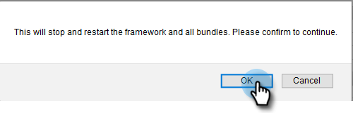
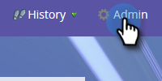

# Configurare l’integrazione di Adobe Experience Manager {#configuring-adobe-experience-manager-integration}

Configura Adobe Experience Manager (AEM) in modo da poter accedere, selezionare e importare le risorse AEM in Marketo Engage Design Studio.

>[!NOTE]
>
>**Autorizzazioni amministratore richieste**

>[!IMPORTANT]
>
>* Questa integrazione funziona solo con le implementazioni on-premise di AEM e non è supportata per le implementazioni di AEM Cloud Service.
>
>* Attualmente, questa funzione è completamente supportata solo in Firefox. Non è supportato in Safari e potrebbe non funzionare nella versione più recente di Chrome, a seconda delle impostazioni del cookie SameSite.

1. Passa a Adobe Experience Manager (l’URL è specifico per la tua azienda).

   

1. Puoi accedere con Adobe o localmente. In questo esempio, effettueremo l’accesso localmente.

   

1. In **[!UICONTROL Tools]**, fare clic su **[!UICONTROL Operations]** e selezionare **[!UICONTROL Web Console]**.

   

1. Nel browser, cerca (Ctrl+F su Windows, Comando+F su Mac) per &quot;[!UICONTROL Adobe Granite Cross-Origin Resource Sharing Policy]&quot;.

   

1. Fai clic sul segno **+** a destra.

   

1. Nella casella di testo **[!UICONTROL Allowed Origins (Regexp)]** digitare `https://.*\.marketo\.com` e fare clic su **[!UICONTROL Save]**.

   

1. Nell&#39;intestazione nella parte superiore della pagina, fare clic su **[!UICONTROL Web Console]** e selezionare **[!UICONTROL System Information]**.

   

1. In Informazioni server fare clic sul pulsante **[!UICONTROL Restart]**.

   

1. Fai clic su **[!UICONTROL OK]** per confermare.

   

1. In Marketo Engage, fai clic su **[!UICONTROL Admin]**.

   

1. In Integrazione, selezionare **[!UICONTROL Adobe Experience Manager]**.

   

1. Fai clic su **[!UICONTROL Edit]**.

   

1. Immetti l&#39;URL di AEM e fai clic su **[!UICONTROL OK]**.

   
