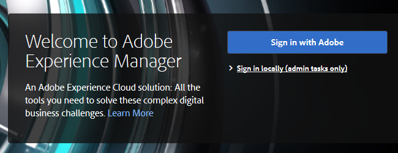

# Configurazione dell&#39;integrazione Adobe Experience Manager {#configuring-adobe-experience-manager-integration}

Configura AEM per accedere, selezionare e importare risorse AEM in Design Studio di Marketo.

>[!NOTE]
>
>**Autorizzazioni amministratore richieste**

>[!CAUTION]
>
>Al momento, questa funzione è supportata solo in Firefox. Non è supportato in Safari e potrebbe non funzionare nella versione più recente di Chrome (v. 80), a seconda delle impostazioni del cookie SameSite.

1. Passate all’Adobe Experience Manager (l’URL è specifico per la società).

   

1. Potete accedere con  Adobe o accedere localmente. In questo esempio, l&#39;accesso verrà eseguito localmente.

   

1. In **Strumenti**, fare clic su **Operazioni** e selezionare Console **** Web.

   

1. Nel browser, cercate (Ctrl+F su Windows, Comando+F su Mac) &quot; Adobe Granite Cross-Origin Resource Sharing Policy&quot; (Criterio di condivisione risorse tra le origini granite).

   

1. Fare clic sul segno **+** a destra.

   

1. Nella casella di testo Origini **consentite (Regexp)** , digitare &quot;https://.*\.marketo\.com&quot; (senza le virgolette) e fate clic su **Salva**.

   

1. Nell’intestazione nella parte superiore della pagina, fate clic su Console **** Web e selezionate Informazioni **** sul sistema.

   

1. In Informazioni sul server, fate clic sul pulsante **Riavvia** .

   

1. Fate clic su **OK** per confermare.

   

1. In Marketing Classic, fai clic su **Admin**.

   

1. In Integrazione, selezionare **Adobe Experience Manager**.

   

1. Fate clic su **Modifica**.

   

1. Inserite l’URL AEM e fate clic su **OK**.

   

   Siete tutti pronti! Ora potete [importare AEM risorse in Design Studio in Marketo Sky](http://help.marketo.com/hc/en-us/articles/360036765993).

