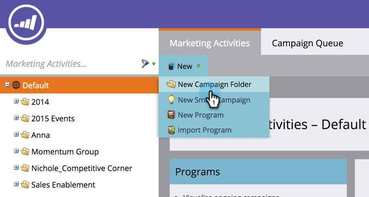

# Creare una nuova cartella campagna {#create-new-campaign-folder}

Le cartelle di Campaign consentono di mantenere un’area di lavoro ordinata. Segui questi passaggi per iniziare.

1. Passa a **[!UICONTROL Marketing Activities]**.

   

1. Seleziona **[!UICONTROL New]**.

   

1. Seleziona **[!UICONTROL New Campaign Folder]**.

   

1. Immetti **[!UICONTROL Name]** per la cartella della campagna.

   

1. Facoltativo: immettere **[!UICONTROL Description]** e fare clic su **[!UICONTROL Create]**.

   >[!TIP]
   >
   >Le descrizioni sono per altri utenti dell’abbonamento. I clienti non visualizzeranno questo messaggio.

   

   La cartella della campagna viene visualizzata nella struttura.

   

   Ora, quando [crei un nuovo programma](/help/marketo/product-docs/core-marketo-concepts/programs/creating-programs/create-a-program.md), viene visualizzata questa cartella della campagna come opzione.

>[!MORELIKETHIS]
>
>* [Creare un programma](/help/marketo/product-docs/core-marketo-concepts/programs/creating-programs/create-a-program.md)
>* [Creare una nuova campagna avanzata](/help/marketo/product-docs/core-marketo-concepts/smart-campaigns/creating-a-smart-campaign/create-a-new-smart-campaign.md)
