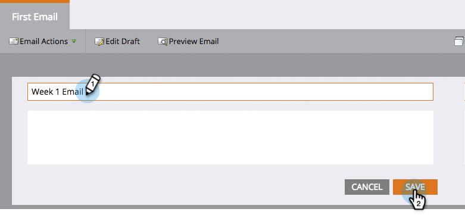

# Rinominare una risorsa Marketo {#rename-a-marketo-asset}

È possibile rinominare cartelle, programmi e risorse locali.

1. Seleziona una risorsa da rinominare e fai clic sul blocco del nome del pannello di destra.

   

1. Digitare un nuovo nome nel campo di testo. Fai clic su **[!UICONTROL Save]**.

   

   >[!NOTE]
   >
   >Non puoi rinominare file e immagini caricati o una risorsa a cui si fa attualmente riferimento in un elenco avanzato o in una campagna avanzata (in filtri, trigger, passaggi di flusso, ecc.).
