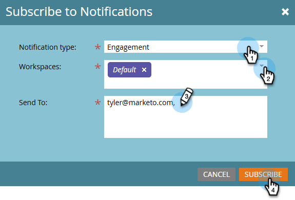

# Informazioni sulle notifiche {#understanding-notifications}

Le notifiche ti mantengono aggiornato sugli eventi di sistema che si verificano nell’abbonamento a Marketo Engage. Ad esempio, le notifiche di errore di Campaign ti informano sugli errori nelle campagne avanzate e le notifiche di sincronizzazione CRM ti avvisano di problemi critici rilevati con la sincronizzazione CRM (ad esempio, autorizzazioni non corrette o sincronizzazione non attiva).

## Panoramica {#overview}

1. Le nuove notifiche vengono visualizzate in alto a sinistra in Marketo Engage.

   

1. Fai clic sull&#39;icona _Notifiche_ per visualizzare tutte le notifiche.

   {width="800" zoomable="yes"}

   >[!NOTE]
   >
   >Le notifiche sono disponibili nel tuo account Marketo per 60 giorni.

## Iscriviti alle notifiche {#subscribe-to-notifications}

Puoi abbonarti alle notifiche per riceverle nell’e-mail.

1. Nella schermata _Notifiche_, fare clic su **[!UICONTROL Subscribe]**.

   

1. Selezionare il _tipo di notifica_ e _Workspace_. Inserisci l’indirizzo e-mail a cui desideri inviare le notifiche (puoi aggiungerne più di uno, separato da una virgola). Al termine, fai clic su **[!UICONTROL Subscribe]**.

   

>[!NOTE]
>
>La casella _[!UICONTROL Send to]_consente solo di immettere un indirizzo e-mail. Non verrà visualizzato un elenco di abbonati esistenti.

In alcuni casi, una notifica fornisce un collegamento &quot;Consulta l’elenco completo&quot; per scaricare un file con valori separati da virgola (CSV), ad esempio il file Errori di sincronizzazione di Microsoft Dynamics. Marketo Engage conserva questi file CSV per 30 giorni. Se tenti di scaricare il file dopo 30 giorni, si verifica un errore.

>[!TIP]
>
>Per annullare l&#39;iscrizione alle e-mail di notifica, fare clic sul collegamento **[!UICONTROL unsubscribe from notifications]** nella parte inferiore dell&#39;e-mail di notifica.
