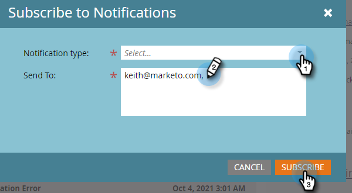

# Notifiche {#understanding-notifications}

Le notifiche ti tengono aggiornato sugli eventi di sistema che si verificano nell’abbonamento a Marketo. Ad esempio, le notifiche di errore di Campaign ti informano sugli errori nelle campagne intelligenti e le notifiche di sincronizzazione CRM ti avvisano di problemi critici rilevati con la sincronizzazione CRM, ad esempio autorizzazioni non corrette o la sincronizzazione non disponibile.

## Panoramica {#overview}

1. Le nuove notifiche vengono visualizzate in alto a destra in Marketo.

   

1. Fai clic su Notifiche per visualizzare tutte le notifiche.

   

## Iscriviti alle notifiche {#subscribe-to-notifications}

Puoi abbonarti alle notifiche per riceverle nella tua e-mail.

1. Vai a Notifiche e fai clic su **Sottoscrivi**.

   

1. Seleziona il Tipo di notifica e immetti gli indirizzi e-mail a cui desideri inviare le notifiche (separati da una virgola). Al termine, fai clic su **Sottoscrivi** .

   

>[!NOTE]
>
>L’area **Invia a** è riservata solo all’utente che deve inserire l’e-mail, ma non presenta un elenco di abbonati esistenti.

In alcuni casi, una notifica fornisce un collegamento &quot;Vedi l’elenco completo&quot; per scaricare un file con valori separati da virgola (CSV), ad esempio il file Errori di sincronizzazione Microsoft Dynamics. Marketo conserva questi file CSV per 30 giorni. Se tenti di scaricare il file dopo 30 giorni, ottieni un errore 404.

>[!TIP]
>
>Desideri annullare l’iscrizione alle e-mail di notifica? Nessun problema. Fai clic sul collegamento **Annulla iscrizione a Notifiche** in fondo all’e-mail.
