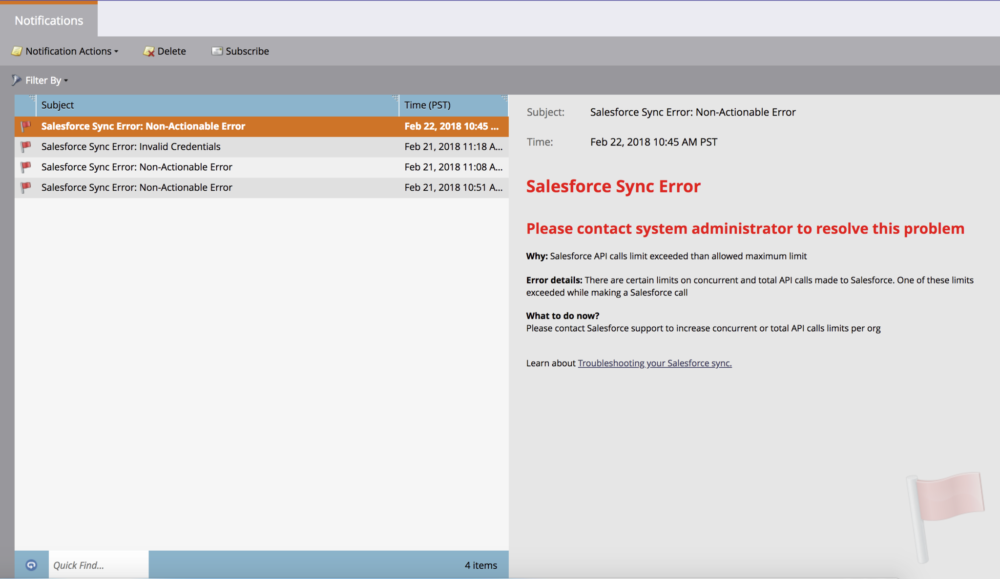

# Tipi di notifica {#notification-types}

Esistono diversi tipi di notifica.

## Errore campagna {#campaign-failure}

Gli errori delle campagne ti avvisano degli errori nelle campagne intelligenti.

## Sincronizzazione CRM {#crm-sync}

Le notifiche di sincronizzazione CRM ti avvisano di problemi critici rilevati con la sincronizzazione CRM, ad esempio autorizzazioni non corrette o la sincronizzazione non disponibile.

**Microsoft Dynamics**

Le notifiche di Dynamics vengono inviate una volta ogni 24 ore e contengono lead che non sono riusciti a sincronizzarsi in quel periodo di tempo. I motivi tipici di un errore sono i lead duplicati (come sopra) o gli errori di mancata corrispondenza della lunghezza del campo.

**Salesforce**

Se utilizzi Salesforce, le notifiche di errore di sincronizzazione avranno un aspetto simile a quello riportato di seguito. Gli errori tipici includono le credenziali scadute e hanno superato i limiti API.

Coinvolgimento

Quando i lead si esauriscono in un flusso, viene inviata una notifica.  La notifica include il numero di lead che si sono esauriti e altre informazioni.

Facebook

Se tenti di inviare lead a Facebook senza accettare i termini del servizio o se tenti di inviare lead a Facebook dopo la rimozione dell’app Marketo.

Pulizia campagna attivatore inattivo

La disattivazione ha attivato campagne avanzate che non ricevono più alcuna attività. Ulteriori informazioni su [pulizia automatica della campagna trigger](/help/marketo/product-docs/core-marketo-concepts/smart-campaigns/using-smart-campaigns/automatic-trigger-campaign-cleanup.md).

LinkedIn

Quando Marketo non è in grado di creare un nuovo pubblico, effettua l’accesso o invia e-mail a LinkedIn dopo tre tentativi.

Servizi Web

Riceverai una notifica al raggiungimento della quota giornaliera. La quota viene ripristinata ogni notte a mezzanotte, ora centrale.

>[!NOTE]
>
>Alcuni dei codici di errore che potresti ricevere sono descritti nella nostra [Documentazione per sviluppatori](https://developers.marketo.com/rest-api/error-codes/#response_level_error_codes).
