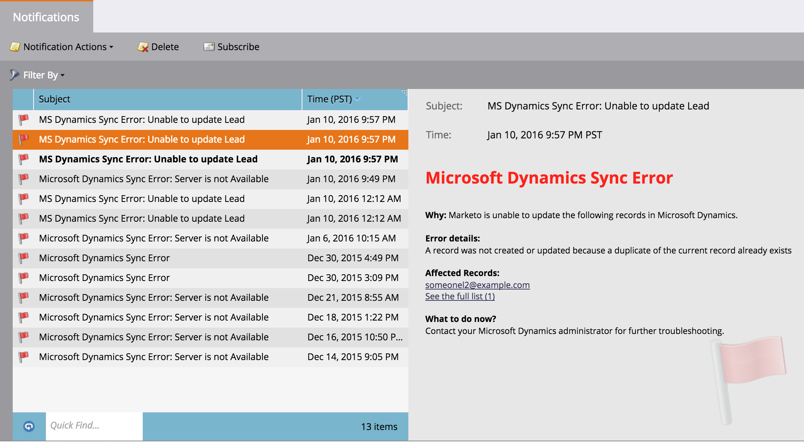

# Tipi di notifica {#notification-types}

Esistono diversi tipi di notifica.

## Errore campagna  {#campaign-failure}

Gli errori delle campagne ti segnalano eventuali errori nelle tue campagne intelligenti.

## Sincronizzazione CRM {#crm-sync}

Le notifiche di sincronizzazione CRM ti avvisano di problemi critici riscontrati con la sincronizzazione CRM, come ad esempio autorizzazioni errate o la sincronizzazione non disponibile.

**Microsoft Dynamics**

Le notifiche di Dynamics vengono inviate una volta ogni 24 ore e contengono lead che non sono stati sincronizzati in quel periodo di tempo. I motivi tipici di un errore sono i lead duplicati (come sopra) o gli errori di mancata corrispondenza della lunghezza del campo.

**Salesforce**

Se usi Salesforce, le notifiche di errore di sincronizzazione hanno un aspetto simile a quello riportato di seguito. Gli errori tipici includono le credenziali scadute e i limiti API superati.

Coinvolgimento

Quando i lead si esauriscono in un flusso, viene inviata una notifica.  La notifica include il numero di lead che si sono esauriti e alcune altre informazioni.

Facebook

Se provate a inviare i lead a Facebook senza accettare i termini di servizio, o se tentate di inviare i lead a Facebook dopo la rimozione dell&#39;app Marketo.

Pulizia campagna attivatore inattivo

Disattiva campagne intelligenti attivate che non ottengono più alcuna attività. Ulteriori informazioni sulla pulizia [automatica delle campagne](../../../../product-docs/core-marketo-concepts/smart-campaigns/using-smart-campaigns/automatic-trigger-campaign-cleanup.md)di attivazione.

LinkedIn

Se Marketo non è in grado di creare un nuovo pubblico, di effettuare il login o di inviare e-mail a LinkedIn dopo tre tentativi.

Servizi Web

Riceverai una notifica quando raggiungi la quota giornaliera. La quota viene ripristinata ogni notte a mezzanotte, ora centrale.

>[!NOTE]
>
>Alcuni dei codici di errore che potresti ricevere sono descritti nella nostra Documentazione [per](http://developers.marketo.com/rest-api/error-codes/#response_level_error_codes)sviluppatori.

