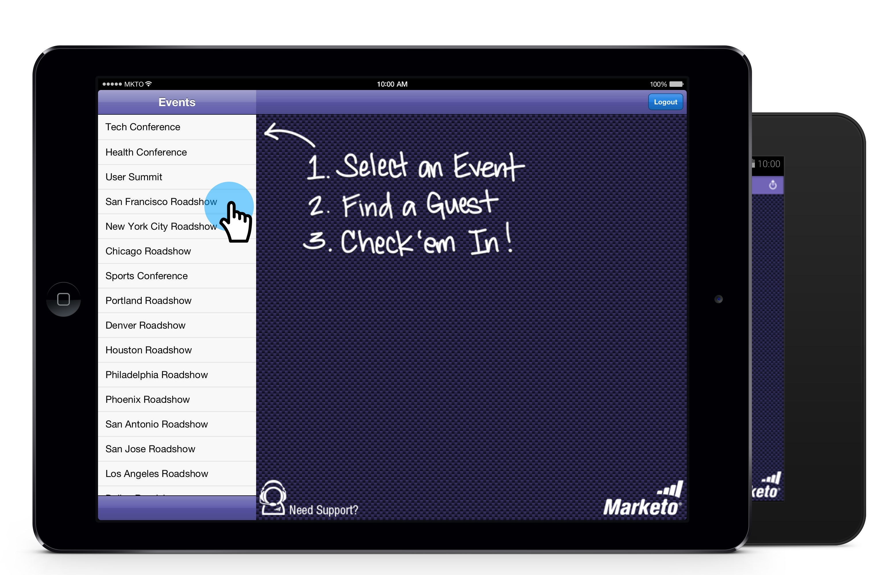
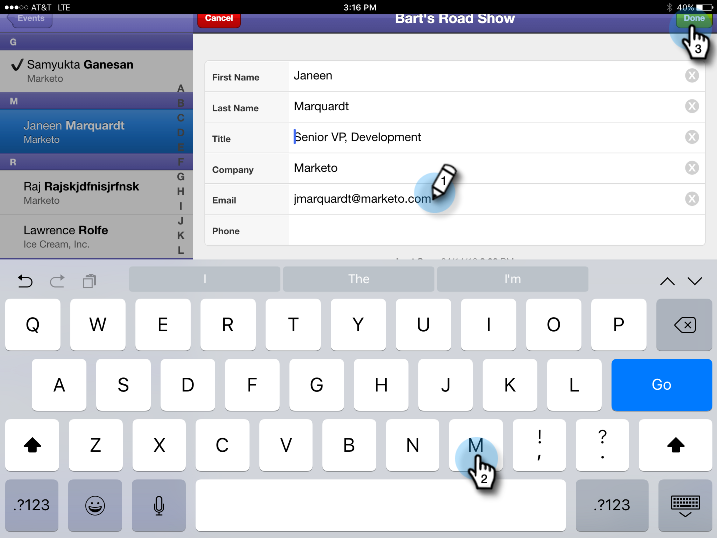

# Controllare l&#39;evento dal Tablet PC {#check-people-into-your-event-from-your-tablet}

Quando le persone si presentano al tuo evento, puoi trovare le loro informazioni nell’app. Dopo il check-in, vengono promossi allo stato Partecipazione durante la sincronizzazione con Marketo.

L’app funziona allo stesso modo sia su iPad che su Android, tranne che per lievi differenze di layout e design.

>[!PREREQUISITES]
>
>* Crea un evento in Marketo e popolalo con persone invitate e registrate.
>* Scarica l’app tablet per [Android](https://play.google.com/store/apps/details?id=com.marketo.eventcheckin&amp;hl=en) o [iOS](https://itunes.apple.com/us/app/marketo-events/id522766637?mt=8)

## Check-in Ospiti registrati {#check-in-registered-guests}

1. Tocca l’icona dell’app sul tuo tablet iPad o Android.

1. Tocca **Login** per avviare l&#39;app Marketo Event.

   

1. Immetti il nome utente e la password di Marketo e fai clic su **Login**.

   >[!NOTE]
   >
   >Per visualizzare le persone nell’app, devi disporre di un ruolo con accesso al database.

1. Seleziona un **Evento**.

   

   >[!TIP]
   >
   >Vengono visualizzati solo i programmi evento (ad eccezione dei webinar) programmati una settimana prima e una settimana dopo la data odierna.

1. Nella schermata iniziale, sfogliare per trovare gli ospiti registrati. Per trovare una persona nell’elenco, puoi:

   * Scorri per trovare un nome
   * Immetti un nome nel campo di ricerca
   * Passa a una lettera iniziale specifica del cognome toccandola sul lato destro dell’elenco

   >[!NOTE]
   >
   >Il processo è lo stesso su iPad e Android, ma gli schermi sono diversi e gli elementi possono trovarsi in posizioni diverse. Questo articolo presenta l’interfaccia di iPad. Confronta la schermata Android in questa sezione come riferimento.

   **iPad**

   

   **Android**

   

1. Tocca il nome selezionato, quindi sul record della persona tocca **Check-in**.

   

L&#39;ospite ora è in stato Partecipato e riceve un segno di spunta. Il record della persona viene aggiornato quando si esegue la sincronizzazione con Marketo. Il contatore rosso sul pulsante Sincronizza viene incrementato per mostrare il numero di check-in dall&#39;ultima sincronizzazione con Marketo. Il pulsante Sync si presenta diversamente ed è in una posizione diversa per iPad e Android:

**iPad**

**Android**

>[!TIP]
>
>Se una persona è stata invitata ma non si è registrata, è possibile cercare il nome facendo clic su **Cerca nel server**, immediatamente sotto la casella di ricerca. Lo stato Invitato cambia in **Partecipazione avvenuta** per l’evento.

## Creare una nuova persona sul tablet {#create-a-new-person-on-the-tablet}

Puoi aggiungere manualmente gli ospiti che non sono persone esistenti nel database di Marketo. Verranno automaticamente archiviati e aggiunti al database durante la sincronizzazione con Marketo.

1. Clic **Aggiungi**.

   **iPad**

   

   **Android**

   

1. Completa il maggior numero possibile di campi delle informazioni di base e tocca **Fine**.

   

   >[!NOTE]
   >
   >Puoi utilizzare solo i campi esistenti. Non puoi crearne di personalizzati.

   >[!CAUTION]
   >
   >Controlla nuovamente l’indirizzo e-mail. Altri campi possono essere corretti in un secondo momento, ma l’indirizzo e-mail è il metodo principale per contattare l’ospite.

La nuova persona è registrata come archiviata nell&#39;evento e verrà aggiunta al database di Marketo con stato Partecipazione durante la sincronizzazione con Marketo.

## Inverti check-in {#reverse-a-check-in}

Se hai archiviato una persona per errore, _prima della sincronizzazione con Marketo_, è possibile invertire lo stato Partecipazione.

1. Tocca il nome nell’elenco e, nel record della persona, tocca **Annulla**.

   

   Tutto risolto!

## Modificare un record persona al momento del check-in {#edit-a-person-record-at-check-in}

Puoi aggiungere e modificare le informazioni dei visitatori direttamente all’evento.

1. Tocca il nome nell’elenco delle persone e tocca **Modifica**.

   

1. Modifica e aggiungi informazioni ai campi, quindi tocca **Fine**.

   

   >[!NOTE]
   >
   >In Android, il **Fine** potrebbe essere nascosto. Scorri verso il basso per trovarlo.

Le informazioni verranno aggiornate al momento della sincronizzazione dell&#39;app con Marketo.

## Sincronizzare l’app con Marketo {#sync-the-app-with-marketo}

L’app Marketo Events funziona in modo indipendente finché non sincronizzi nuovamente l’attività con il database di Marketo. È consigliabile eseguire la sincronizzazione il prima possibile dopo l&#39;ultimo check-in. Il tablet deve essere connesso a Internet.

>[!CAUTION]
>
>Dopo la sincronizzazione, non è possibile annullare un check-in dall&#39;app.

1. Sul tablet, apri l’app e passa all’evento.

1. Tocca **Sincronizza**.

   L’evento viene aggiornato con le nuove archiviazioni nel database di Marketo. Il contatore rosso sul pulsante Sincronizza si cancella finché non si archivia un altro utente.

   Per motivi di sicurezza, devi uscire dall’app Marketo Events al termine della sincronizzazione.

## Utilizzo dell&#39;accesso limitato a Internet {#working-with-limited-internet-access}

Alcuni luoghi hanno uno scarso accesso a Internet. È necessaria una buona connessione a:

* Scaricare e installare l’app
* Accedi
* Seleziona un evento
* Sincronizzare l’app con Marketo

Se sei preoccupato dell&#39;accesso a Internet, puoi accedere all&#39;app Marketo Events e selezionare l&#39;evento in anticipo, in una posizione con un forte accesso a Internet. In questo modo, puoi comunque utilizzare l’app offline. Quindi, quando si riprende una connessione Internet, eseguire immediatamente la sincronizzazione con il database di Marketo.

>[!TIP]
>
>Se non si dispone di una connessione a Internet, è comunque possibile creare una nuova persona per l&#39;archiviazione. Si riconcilierà con la persona esistente quando sincronizzerai l&#39;app.

>[!NOTE]
>
>L’app ti disconnette automaticamente dopo otto ore di inattività.
