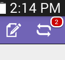

# Controllare le persone all&#39;evento dal Tablet {#check-people-into-your-event-from-your-tablet}

Quando le persone si presentano all&#39;evento, potete trovare le loro informazioni nell&#39;app. Dopo il check-in, vengono promossi allo stato Partecipante al momento della sincronizzazione con Marketo.

L&#39;app funziona allo stesso modo sia su iPad che su Android, fatta eccezione per lievi differenze di layout e progettazione.

>[!PREREQUISITES]
>
>* Create un evento in Marketo e popolatelo con persone invitate e registrate.
>* Scaricate l&#39;app per tablet per [Android](https://play.google.com/store/apps/details?id=com.marketo.eventcheckin&amp;hl=en) o [iOS](https://itunes.apple.com/us/app/marketo-events/id522766637?mt=8)

## Archivia ospiti registrati {#check-in-registered-guests}

1. Toccate l&#39;icona dell&#39;app sull&#39;iPad o sul tablet Android.

1. Toccate **Login** per avviare l&#39;app Marketo Event.

   

1. Inserite il nome utente e la password di Marketo e fate clic su **Login**.

   >[!NOTE]
   >
   >È necessario avere un ruolo con accesso al database per vedere le persone nell&#39;app.

1. Selezionare un evento **Event**.

   

   >[!TIP]
   >
   >Vengono visualizzati solo i programmi dell&#39;evento (ad eccezione dei webinar) pianificati una settimana prima e una settimana dopo la data odierna.

1. Nella schermata Home, individuate gli ospiti registrati. Per trovare una persona nell’elenco, potete:

   * Scorri per trovare un nome
   * Inserisci un nome nel campo di ricerca
   * Passare a una lettera iniziale specifica del cognome toccandolo sul lato destro dell’elenco

   >[!NOTE]
   >
   >Il processo è lo stesso su iPad e Android, ma le schermate differiscono e gli elementi possono trovarsi in posizioni diverse. Questo articolo dispone dell’interfaccia iPad. Confrontate la schermata Android in questa sezione per riferimento.

   **iPad**

   

   **Android**

   

1. Toccate il nome selezionato e, sul record della persona, toccate **Check-in**.

   

L&#39;ospite ora ha uno stato Partecipante e riceve un segno di spunta. Il record della persona viene aggiornato al momento della sincronizzazione con Marketo. Il contatore rosso sul pulsante Sinc. incrementa per mostrare il numero di check-in dall&#39;ultima sincronizzazione con Marketo. Il pulsante Sinc. è diverso ed è in una posizione diversa per iPad e Android:

**iPad**

**Android**

>[!TIP]
>
>Se una persona è invitata ma non si è registrata, è possibile cercare il nome facendo clic su **Cerca sul server**, immediatamente sotto la casella di ricerca. Lo stato Invitato cambia in **Partecipato** per l&#39;evento.

## Crea una nuova persona sul tablet {#create-a-new-person-on-the-tablet}

Puoi aggiungere manualmente gli ospiti che non sono persone esistenti nel database Marketo. Verranno automaticamente archiviati e aggiunti al tuo database al momento della sincronizzazione con Marketo.

1. Fare clic su **Aggiungi**.

   **iPad**

   

   **Android**

   

1. Completate tutti i campi di informazioni di base possibili e toccate **Done**.

   

   >[!NOTE]
   >
   >È possibile utilizzare solo i campi esistenti. Non è possibile crearne di personalizzati.

   >[!CAUTION]
   >
   >Controllate l’indirizzo e-mail. Altri campi possono essere corretti in seguito, ma l&#39;indirizzo e-mail è il metodo principale per contattare l&#39;ospite.

La nuova persona viene registrata come selezionata nell’evento e verrà aggiunta al database Marketo con stato Partecipante al momento della sincronizzazione con Marketo.

## Inverti un check-in {#reverse-a-check-in}

Se avete eseguito il check-in di una persona per errore, _prima di eseguire la sincronizzazione con Marketo_, potete annullare lo stato Partecipante.

1. Toccate il nome nell&#39;elenco e, nel record della persona, toccate **Annulla**.

   

   Tutto fisso!

## Modifica di un record di persona al check-in {#edit-a-person-record-at-check-in}

Potete aggiungere e modificare le informazioni sugli ospiti direttamente all&#39;evento!

1. Toccate il nome nell&#39;elenco delle persone e toccate **Modifica**.

   

1. Modificate e aggiungete informazioni ai campi, quindi toccate **Fine**.

   

   >[!NOTE]
   >
   >In Android, il pulsante **Fine** potrebbe essere nascosto. Scorri verso il basso per trovarlo.

Le informazioni verranno aggiornate al momento della sincronizzazione dell&#39;app con Marketo.

## Sincronizzazione dell&#39;app con Marketo {#sync-the-app-with-marketo}

L&#39;app Marketo Events funziona in modo indipendente finché l&#39;attività non viene nuovamente sincronizzata nel database Marketo. È consigliabile sincronizzare il più presto possibile dopo l&#39;ultimo check-in. Il tablet deve essere connesso a Internet.

>[!CAUTION]
>
>Dopo la sincronizzazione, non potete annullare un check-in dall&#39;app.

1. Sul tablet, aprite l&#39;app e navigate all&#39;evento.

1. Toccate **Sincronizza**.

   L&#39;evento viene aggiornato con nuovi check-in nel database Marketo. Il contatore rosso sul pulsante Sinc. viene cancellato fino a quando non viene eseguito il check-in di qualcun altro.

   Per motivi di sicurezza, al termine della sincronizzazione, chiudete l’app Marketo Events.

## Utilizzo di accesso Internet limitato {#working-with-limited-internet-access}

Alcuni luoghi hanno un accesso a Internet scadente. È necessario un buon collegamento a:

* Scaricare e installare l&#39;app
* Login
* Selezione di un evento
* Sincronizzazione dell&#39;app con Marketo

Se siete preoccupati per l&#39;accesso a Internet all&#39;evento, potete accedere all&#39;app Marketo Events e selezionare l&#39;evento in anticipo, in una posizione con un forte accesso a Internet. In tal modo, potete comunque utilizzare l&#39;app offline. Quindi, quando riacquistate una connessione Internet, sincronizzate immediatamente il database Marketo.

>[!TIP]
>
>Se non disponete di una connessione Internet, potete comunque creare una nuova persona per il check-in. Si riconcilierà con la persona esistente quando sincronizzate l&#39;app.

>[!NOTE]
>
>L&#39;app ti disconnette automaticamente dopo otto ore di inattività.
