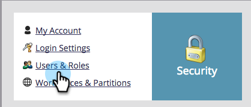
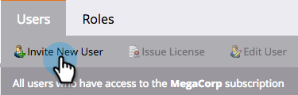

# Concedere agli utenti l’accesso all’app di archiviazione {#grant-users-access-to-the-check-in-app}

Marketo ha un ruolo utente speciale per l’app di archiviazione degli eventi. Ecco come creare un nuovo ruolo con l’autorizzazione per utilizzare l’app.

## Crea un nuovo ruolo utente per dispositivi mobili {#create-a-new-user-role-for-mobile}

1. Clic **Amministratore**.

   

1. Clic **Utenti e ruoli**.

   

1. Fai clic su **Ruoli** , quindi fai clic su **Crea Ruolo**.

   

1. Immettere un nome per il nuovo ruolo e una descrizione facoltativa. Controlla la **Accedi all&#39;applicazione mobile** e fai clic su **Crea**.

   

   Il nuovo ruolo è pronto per essere assegnato quando si invitano persone a utilizzare l&#39;app tablet.

## Invita nuovi utenti per l&#39;app di archiviazione {#invite-new-users-for-the-check-in-app}

1. Fai clic su **Utenti** scheda.

   

1. Clic **Invita nuovo utente**.

   

1. Immettere le informazioni del nuovo utente. Seleziona le caselle di controllo per tutti i ruoli appropriati e il nuovo ruolo con l’autorizzazione per accedere all’app mobile. Clic **Invita** quando hai finito.

   

   >[!CAUTION]
   >
   >Gli utenti che non hanno accesso al database non possono visualizzare le persone nell’app.

   >[!TIP]
   >
   >Per gli utenti esistenti, è possibile creare un nuovo ruolo o aggiungere l&#39;autorizzazione Accedi all&#39;applicazione mobile al ruolo corrente.

L’utente riceverà un’e-mail per informarlo di avere accesso all’app di archiviazione.
