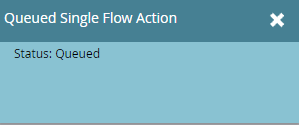

# Preparati per l’evento {#prepare-for-your-event}

Ci sono diverse cose da fare per prepararsi all&#39;evento.

## Crea un nuovo ruolo Marketo {#create-a-new-marketo-role}

Marketo ha un ruolo utente speciale per l’app di archiviazione degli eventi. [Crea un nuovo ruolo Marketo](/help/marketo/product-docs/core-marketo-concepts/mobile-apps/event-check-in/grant-users-access-to-the-check-in-app.md) per utenti iPad o Android, con l’autorizzazione di accesso all’app mobile.

## Invita nuovi utenti Tablet PC all&#39;evento {#invite-new-tablet-users-to-the-event}

[Invita nuovi utenti tablet all&#39;evento](/help/marketo/product-docs/core-marketo-concepts/mobile-apps/event-check-in/grant-users-access-to-the-check-in-app.md) e assegnargli il nuovo ruolo.

## Creazione di un nuovo programma eventi di Marketo {#create-a-new-marketo-event-program}

[Creazione di un nuovo programma eventi di Marketo](/help/marketo/product-docs/demand-generation/events/understanding-events/create-a-new-event-program.md) acquisire lo stato delle persone durante il loro avanzamento in diverse fasi e ottenere misurazioni accurate del ROI per le iniziative di marketing.

## Specificare le date dell&#39;evento {#specify-the-event-dates}

Impostare le date dell&#39;evento è un&#39;operazione immediata.

1. Fai clic sull’evento nella pianificazione e imposta la data e l’ora di inizio e di fine.

   

1. Scorri verso l&#39;alto per cambiare **Provvisorio** a **Confermato**.

   

   >[!CAUTION]
   >
   >Se la data dell’evento è anteriore o posteriore di più di una settimana alla data corrente, l’evento non verrà visualizzato nell’app. **Suggerimento**: per eseguire il test, imposta temporaneamente le date su entro una settimana dalla data odierna. Ricordati di ripristinare le date corrette dell’evento dopo averlo testato.

## Aggiungi persone al tuo evento {#add-people-to-your-event}

Ora che conosci *quando*, è ora di aggiungere *chi*.

1. Se si dispone già di un elenco di persone, in Il mio Marketo fare clic sul pulsante **Database** affiancare.

   

1. Seleziona un elenco con persone e fai clic su **Persone** scheda.

   

1. Seleziona dall’elenco le persone per il tuo evento. Utilizzare **Ctrl** (o **Comando** su un Mac) per fare clic su più persone, oppure **Seleziona tutto** per contrassegnarli tutti.

   

1. Clic **Azioni della persona**, passaggio del mouse **Programmi** e seleziona **Modifica stato programma**.

   

1. Fai clic su **Programma** e seleziona l’evento.

   

1. Fai clic su **Nuovo stato** a discesa e selezionare **Roadshow > Registrato**. Clic **Esegui ora**.

   

1. Una piccola finestra mostra lo stato di avanzamento...

   

1. ...e indica quando l&#39;attività è completa.

   

   Le persone selezionate sono ora nel tuo evento, pronte per il check-in tramite l’app tablet nell’ambito della fiera.
