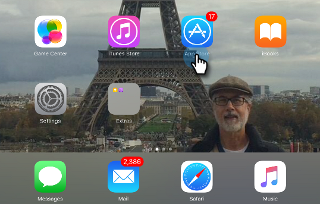

# Configurazione iPad o Android Tablet {#set-up-the-ipad-or-android-tablet}

Per un’esperienza fluida durante il giorno dell’evento, prepara il tuo tablet iPad o Android e testa l’app Marketo Events prima dell’evento.

Dopo aver creato l&#39;evento in Marketo, questo viene caricato nell&#39;iPad Marketo Events o nell&#39;app Android al momento dell&#39;accesso, se:

* L&#39;account ha accesso al database
* L’evento è pianificato in una data del periodo di tempo che inizia una settimana prima e termina una settimana dopo la data corrente
* L&#39;evento è stato creato nel canale appropriato (ad esempio, Roadshow)

>[!NOTE]
>
>Per scaricare le app è necessario essere connessi a Internet.

## Scarica e installa l&#39;app per iPad degli eventi Marketo {#download-and-install-the-marketo-events-ipad-app}

Se il tuo iPad non ha già installato l&#39;app Marketo Events, ecco come ottenerlo.

1. Apri il tuo iPad e avvia l&#39;App Store.

   

1. Nella casella di ricerca, immetti **Marketo** e in Suggerimenti, tocca **marketo events**.

   

1. Segui le procedure per scaricare e installare l’app sul tuo iPad.

## Scarica e installa l&#39;app Android per Marketo Events {#download-and-install-the-marketo-events-android-app}

Se il tuo tablet Android non ha ancora installato l&#39;app Marketo Events, ecco come ottenerlo.

1. Apri il tablet e tocca l&#39;app **Google Play Store** .
1. Nella casella Ricerca, immetti **Marketo** e tocca **Invio**.
1. Nei risultati della ricerca, tocca l’app **Marketo Events** .

   

1. Segui le procedure per scaricare e installare l’app sul tuo tablet.

## Conferma le credenziali di accesso per gli utenti di iPad e Tablet {#confirm-login-credentials-for-ipad-and-tablet-users}

Prima di assegnare gli iPad o i tablet al personale dello show, verifica che le credenziali di accesso che utilizzeranno funzionino correttamente e che l&#39;evento venga visualizzato nella schermata iniziale dell&#39;app.

1. Segui le procedure di accesso per iPad o tablet per accedere.
1. Conferma che l’evento venga visualizzato nella schermata iniziale. Ricorda, viene visualizzato solo se le date sono entro una settimana prima e una settimana dopo la data corrente.

   

   >[!NOTE]
   >
   >Dopo la creazione di un nuovo evento, la visualizzazione nell’app iPad o tablet può richiedere alcuni minuti. Se non viene visualizzato, toccare **Logout** nella schermata iniziale, attendere alcuni minuti, quindi accedere di nuovo.

## Sincronizza l’app per popolare l’evento {#sync-the-app-to-populate-the-event}

Sincronizza per assicurarti che le persone aggiunte siano presenti.

1. Apri l’evento nell’app iPad o Android.
1. Cerca le persone. Se non li vedi, tocca **Sincronizza** per sincronizzare l&#39;app e ricaricare l&#39;elenco Persone eventi.

   **iPad**

   

   **Android**

   

## Conferma il funzionamento dei Check-In {#confirm-check-ins-are-working}

Assicurati di confermare che i check-in funzionano dall&#39;iPad o dal tablet prima dell&#39;evento.

1. Nell&#39;app, [verifica un lead di test in](/help/marketo/product-docs/core-marketo-concepts/mobile-apps/event-check-in/check-people-into-your-event-from-your-tablet.md).
1. Tocca l’icona **Sincronizza** per sincronizzare l’app.
1. In Marketo, apri l&#39;evento e fai clic su **Membri**.

   

1. Conferma che lo stato della persona sia cambiato in **Attended** e che sia selezionato Successo.

   

   >[!TIP]
   >
   >Usa te stesso come persona di prova.
