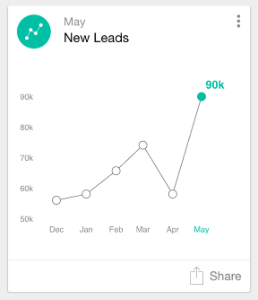

# Informazioni sulle schede di Analytics {#understanding-analytics-cards}

All&#39;inizio di ogni mese, Marketo Moments fornisce tre diverse schede di report: Lead acquisiti, nuovi lead e annullamenti degli abbonamenti. Ognuna mostra le prestazioni mensili e la tendenza su un periodo di sei mesi.

## Schede Analytics {#analytics-cards}

Quando tocchi una scheda di Analytics puoi:

* [Farlo diventare un preferito](/help/marketo/product-docs/core-marketo-concepts/mobile-apps/marketo-moments/working-with-moments/creating-a-favorite.md)
* [Contrassegna come fatto](/help/marketo/product-docs/core-marketo-concepts/mobile-apps/marketo-moments/working-with-moments/marking-it-done.md)
* [Condividi](/help/marketo/product-docs/core-marketo-concepts/mobile-apps/marketo-moments/working-with-moments/sharing-a-moment.md)

Tocca una scheda di Analytics per visualizzare:

* Un grafico dei risultati degli ultimi sei mesi
* Confronto tra mesi e mesi
* Un grafico a barre dei tre o dei tre principali (a seconda della scheda)

Ad esempio, diamo un&#39;occhiata ai dettagli della scheda Acquisred Leads Analytics:

In questo esempio, il rosso indica che il valore è diminuito nell’intervallo di date selezionato (oh!). Il verde indica che il valore è aumentato (yay!).

## Lead acquisiti {#acquired-leads}

La scheda **Lead acquisiti** mostra un rapporto mensile con tendenze relative al numero di nuovi lead.

>[!NOTE]
>
>Sono visibili solo i lead con un programma di acquisizione definito.

## Nuovi lead {#new-leads}

La scheda **Nuovi lead** mostra una tendenza nel rapporto mese-su-mese del numero totale di nuovi lead nell’istanza negli ultimi sei mesi.

## Annulla sottoscrizione {#unsubscribes}

La scheda **Annulla abbonamenti** mostra un rapporto di tendenza mensile su mese del tasso di annullamento dell’abbonamento negli ultimi sei mesi.

Ora lo sai.

>[!MORELIKETHIS]
>
>* [I momenti di Marketo](/help/marketo/product-docs/core-marketo-concepts/mobile-apps/marketo-moments/understanding-moments/understanding-marketo-moments.md)
>* [Informazioni sulle schede evento](/help/marketo/product-docs/core-marketo-concepts/mobile-apps/marketo-moments/understanding-moments/understanding-event-cards.md)
>* [Informazioni sulle schede del programma e-mail](/help/marketo/product-docs/core-marketo-concepts/mobile-apps/marketo-moments/understanding-moments/understanding-email-program-cards.md)

