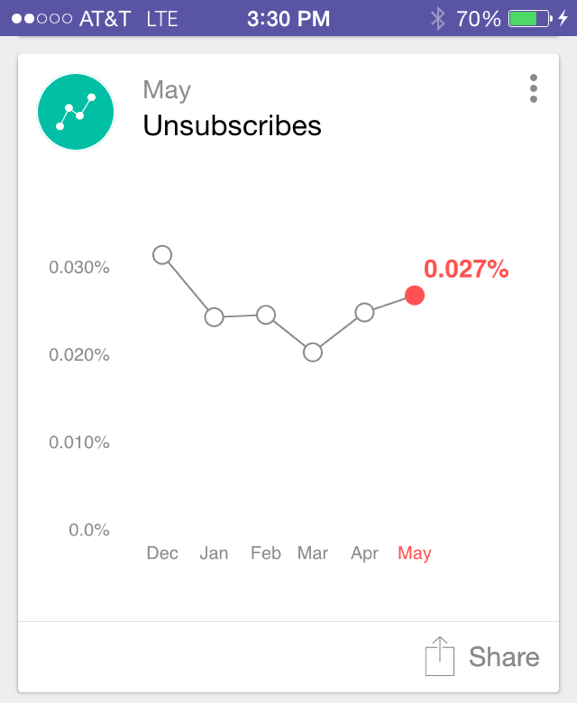

# Informazioni sulle schede di Analytics {#understanding-analytics-cards}

All&#39;inizio di ogni mese, Marketo Moments fornisce tre diverse schede di rapporti: [!UICONTROL Acquired Leads], [!UICONTROL New Leads] e [!UICONTROL Unsubscribes]. Ciascuno mostra le prestazioni mensili e la tendenza su un periodo di sei mesi.

>[!IMPORTANT]
>
>Il 2 ottobre 2023, Adobe ha rimosso l’app Marketo Moments da tutti gli app store. Se l&#39;app è già installata sul tuo tablet/dispositivo mobile, puoi continuare a utilizzarla per il momento. Una volta migrata l’istanza Marketo Engage ad Adobe Identity per l’autenticazione di Marketo, non potrai più accedere all’app. [Ulteriori informazioni](https://nation.marketo.com/t5/product-discussions/marketo-events-app-and-marketo-moments-app-end-of-life/m-p/340712/highlight/true#M193869){target="_blank"}.

## Schede di Analytics {#analytics-cards}

Quando tocchi una scheda di Analytics puoi:

* [Imposta come preferito](/help/marketo/product-docs/core-marketo-concepts/mobile-apps/marketo-moments/working-with-moments/creating-a-favorite.md)
* [Contrassegna come completato](/help/marketo/product-docs/core-marketo-concepts/mobile-apps/marketo-moments/working-with-moments/marking-it-done.md)
* [Condividi](/help/marketo/product-docs/core-marketo-concepts/mobile-apps/marketo-moments/working-with-moments/sharing-a-moment.md)

Tocca una scheda Analytics per visualizzare:

* Un grafico dei risultati degli ultimi sei mesi
* Un confronto mese dopo mese
* Un grafico a barre del massimo o dei primi tre (a seconda della scheda)

Vediamo ad esempio i dettagli della scheda Analytics [!UICONTROL Acquired Leads]:

In questo esempio, il rosso indica che il valore è diminuito nell’intervallo di date selezionato (oh!). Il verde indica che il valore è aumentato (yay!).

## [!UICONTROL Acquired Leads] {#acquired-leads}

La scheda **[!UICONTROL Acquired Leads]** mostra un report del numero di nuovi lead con tendenze mese-su-mese.

>[!NOTE]
>
>Sono visibili solo i lead con un programma di acquisizione definito.

## [!UICONTROL New Leads] {#new-leads}

La scheda **[!UICONTROL New Leads]** mostra un report del numero totale di nuovi lead nella tua istanza negli ultimi sei mesi, mese dopo mese.

## [!UICONTROL Unsubscribes] {#unsubscribes}

La scheda **[!UICONTROL Unsubscribes]** mostra un report sull&#39;andamento mese-su-mese del tasso di annullamento degli abbonamenti negli ultimi sei mesi.

>[!MORELIKETHIS]
>
>* [Informazioni su Marketo Moments](/help/marketo/product-docs/core-marketo-concepts/mobile-apps/marketo-moments/understanding-moments/understanding-marketo-moments.md)
>* [Informazioni sulle schede eventi](/help/marketo/product-docs/core-marketo-concepts/mobile-apps/marketo-moments/understanding-moments/understanding-event-cards.md)
>* [Informazioni sulle schede dei programmi e-mail](/help/marketo/product-docs/core-marketo-concepts/mobile-apps/marketo-moments/understanding-moments/understanding-email-program-cards.md)
