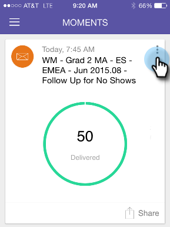

# Informazioni su Marketo Moments {#understanding-marketo-moments}

Il potere di Marketo ora è nelle vostre mani, letteralmente! Visualizza l’anteprima e riprogramma le e-mail direttamente dal telefono o da iPad.

>[!AVAILABILITY]
>
>
>È necessaria l&#39;autorizzazione per accedere alle app per dispositivi mobili. Contatta il tuo amministratore Marketo per [aggiorna il ruolo](/help/marketo/product-docs/administration/users-and-roles/managing-user-roles-and-permissions.md).

## Flussi {#streams}

Ecco i diversi flussi in Moments (Momenti).

>[!NOTE]
>
>**Definizione**
>
>* Momenti: Qui vanno tutti i programmi che sono stati eseguiti o che sono in procinto di essere eseguiti.
>* Preferiti: qui viene inserito tutto ciò che si crea come preferito.
>* Più tardi: Qui entra tutto ciò che accade più tardi di questo momento.
>* Fine: qui viene visualizzato tutto ciò che è stato completato o che è stato contrassegnato come completato.

Ok, ora che ce l&#39;abbiamo fatta, diamo un&#39;occhiata a Marketo Moments al telefono!

## Tre tipi di schede {#three-kinds-of-cards}

Marketo Moments offre tre diverse schede per seguire l’avanzamento della tua e-mail:

**Sul deck** - Questa e-mail sta per essere inviata. È l’ultima possibilità per visualizzarlo in anteprima, inviarne un campione o, anche per annullarlo, se necessario.

**Battito cardiaco** - Hey - Questa e-mail viene consegnata ora! Ed ecco anche le statistiche. Vai avanti e condividilo.

**Risultati** - Ecco come è andata l’e-mail. Al termine dell’esecuzione dell’e-mail, nella scheda Risultati vengono visualizzati il punteggio di coinvolgimento e altre statistiche.

## Flusso Moments {#moments-stream}

La prima volta che apri l’app o tocca **Momenti** nel menu, le relative schede vengono visualizzate per prime. Ciascuna contiene informazioni su quella specifica iniziativa di marketing e sulle sue prestazioni complessive.

Toccando la scheda si apre una schermata di dettaglio.

>[!NOTE]
>
>Le carte arancioni sono confermate; quelle grigie sono provvisorie.

Toccando i tre punti si apre il menu delle azioni della scheda.

Fantastico! Ora puoi fare qualcosa toccando:

>[!NOTE]
>
>**Definizione**
>
>* Preferito: è facile prestare attenzione alle cose più tempestive e importanti se le si rende preferite.
>* Fine: la funzione Fine la elimina dalla vista Momenti Marketo (ma la lascia in Marketo, sicura e sonora).
>* Condividi: invia un’immagine per motivare o congratularsi con il team.
>* Invia campione (solo e-mail): utilizza questa opzione per consentire ad altri di controllare l’aspetto delle e-mail prima che vengano inviate.
>* Anteprima e-mail (solo e-mail): è sempre consigliabile controllare le e-mail in anticipo.

## Momenti successivi {#later-moments}

La sezione Più tardi mostra le attività imminenti.

1. Per iniziare, tocca il menu hamburger.

   

1. Tocca **Più tardi**.

   

   Consulta un elenco delle attività imminenti.

   

## Schede programma e-mail {#email-program-cards}

Le schede del programma e-mail mostrano cose importanti come pianificazione, pubblico, stato e altre cose utili, anche quando sei fuori a pranzo.

## Schede evento {#event-cards}

Per gli eventi, visualizzerai il numero totale di membri e il loro stato.

## Schede di Analytics {#analytics-cards}

Le schede Momento di Analytics mostrano le prestazioni mensili delle e-mail e degli eventi negli ultimi sei mesi, per:

1. Lead acquisiti
1. Nuovi lead
1. Annulla iscrizione

## Schede di esecuzione Smart Campaign {#smart-campaign-run-cards}

Le smart campaign card rappresentano una singola esecuzione di una campagna. A ogni esecuzione della smart campaign viene visualizzata una nuova scheda. Tocca per visualizzare l’elenco avanzato dei filtri utilizzati, il flusso della campagna e ciascuno dei messaggi e-mail utilizzati nella campagna.

## Conferma o Annulla un&#39;azione {#confirm-or-cancel-an-action}

In ogni passaggio della procedura, puoi confermare o annullare un’azione. Se cambi idea, tocca **Non importa**.

## Versioni supportate  {#supported-versions}

Marketo Moments supporta le seguenti versioni del sistema operativo:

* Apple iOS 8.0 e versioni successive.
* Android versione 4.1 e successive (fondamentalmente Jellybean e versioni successive).

Vuoi saperne di più?

>[!MORELIKETHIS]
>
>* [Informazioni sulle schede del programma e-mail](/help/marketo/product-docs/core-marketo-concepts/mobile-apps/marketo-moments/understanding-moments/understanding-email-program-cards.md)
>* [Informazioni sulle schede evento](/help/marketo/product-docs/core-marketo-concepts/mobile-apps/marketo-moments/understanding-moments/understanding-event-cards.md)
>* [Informazioni sulle schede di Analytics](/help/marketo/product-docs/core-marketo-concepts/mobile-apps/marketo-moments/understanding-moments/understanding-analytics-cards.md)
>* [Informazioni sulle schede per campagne avanzate](/help/marketo/product-docs/core-marketo-concepts/mobile-apps/marketo-moments/understanding-moments/understanding-smart-campaign-cards.md)
