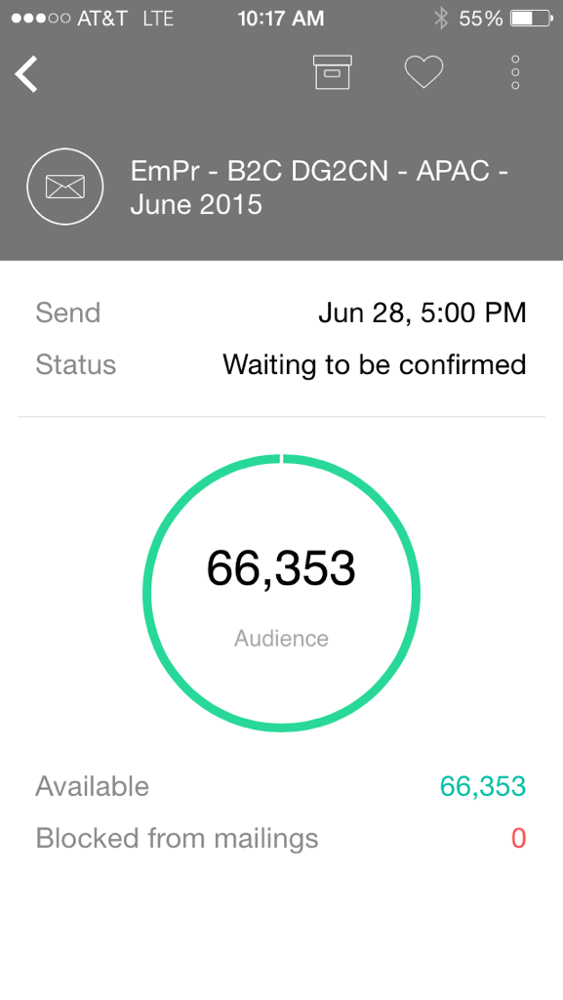

# I momenti di Marketo {#understanding-marketo-moments}

Il potere di Marketo è ora nelle vostre mani, letteralmente! Anteprima e riprogrammazione di e-mail direttamente dal telefono o dall’iPad.

>[!AVAILABILITY]
>
>
>È richiesta l&#39;autorizzazione per l&#39;accesso alle app mobili. Contatta il tuo amministratore Marketo per [aggiornare il tuo ruolo](/help/marketo/product-docs/administration/users-and-roles/managing-user-roles-and-permissions.md).

## Flussi {#streams}

Ecco i diversi flussi in Momenti.

>[!NOTE]
>
>**Definizione**
>
>* Momenti: Tutto quello che è appena corso, o che sta per correre, va qui.
>* Preferiti: Ogni cosa che fai un preferito entra qui.
>* Più tardi: Tutto ciò che accade più tardi di questo momento va qui dentro.
>* Fatto: Tutto quello che ha finito di funzionare o che hai segnato come fatto va qui.

Ok, ora che abbiamo questo fuori strada, diamo un&#39;occhiata al Marketo Moments al telefono!

## Tre tipi di schede {#three-kinds-of-cards}

Marketo Moments offre tre diverse schede per seguire l’avanzamento della tua e-mail:

**On-deck**  - Questa e-mail sta per uscire. È la tua ultima possibilità di visualizzarlo in anteprima, inviare un campione o, se necessario, annullarlo.

**Heart-beat**  - Ehi - questa e-mail è stata consegnata ora! E ci sono anche statistiche. Vai avanti e condividilo.

**Risultati**  - Ecco come ha fatto l&#39;e-mail. Al termine dell’esecuzione dell’e-mail, nella scheda Risultati viene visualizzato il punteggio di coinvolgimento e altre statistiche.

## Flusso di momenti {#moments-stream}

Quando apri l&#39;app o tocca **Momenti** nel menu, vengono visualizzate per prime le schede pertinenti. Ognuna contiene informazioni su questa specifica iniziativa di marketing e sulle sue prestazioni complessive.

Toccando la scheda si apre una schermata di dettaglio.

>[!NOTE]
>
>Le carte d&#39;arancia sono confermate; quelli grigi sono tentativi.

Toccando i tre punti si apre un menu di azione della scheda .

Fantastico! Ora, puoi realizzare qualcosa toccando:

>[!NOTE]
>
>**Definizione**
>
>* Preferito: È facile prestare attenzione alle cose che sono più puntuali e importanti se le fai preferite.
>* Fatto: Fatto ottiene fuori la visualizzazione Marketo Moments (ma lascia in Marketo, sicuro e sonoro).
>* Condividi: Invia un&#39;immagine per motivare o congratularsi con il tuo team.
>* Invia esempio (solo e-mail): Utilizza questo per consentire agli altri di controllare l’aspetto delle tue e-mail prima di inviarle.
>* Anteprima e-mail (solo e-mail): È sempre una buona idea controllare le tue e-mail in anticipo.

## Momenti successivi {#later-moments}

La sezione Successivo mostra le attività imminenti.

1. Per iniziare, tocca il menu hamburger.

   

1. Tocca **Più tardi**.

   

   Visualizza un elenco delle attività in arrivo.

   

## Schede del programma e-mail {#email-program-cards}

Le schede dei programmi e-mail mostrano cose importanti come la pianificazione, il pubblico, lo stato e altre cose utili, anche quando sei fuori a pranzo.

## Schede evento {#event-cards}

Per gli eventi, verrà visualizzato il numero totale di membri e il relativo stato.

## Schede Analytics {#analytics-cards}

Le schede Moment di Analytics mostrano le prestazioni mensili delle e-mail e degli eventi negli ultimi sei mesi, per:

1. Lead acquisiti
1. Nuovi lead
1. Annulla sottoscrizione

## Schede di esecuzione di una campagna intelligente {#smart-campaign-run-cards}

Le schede smart per campagne rappresentano una singola esecuzione di una campagna. A ogni esecuzione della campagna intelligente viene visualizzata una nuova scheda. Tocca per visualizzare i filtri degli elenchi avanzati utilizzati, il flusso della campagna e ciascuno dei messaggi e-mail utilizzati nella campagna.

## Conferma o Annulla un&#39;azione {#confirm-or-cancel-an-action}

Per ogni passaggio, puoi confermare o annullare un’azione. Se cambi idea, basta toccare **Never Mind**.

## Versioni supportate {#supported-versions}

Marketo Moments supporta le seguenti versioni del sistema operativo:

* Apple iOS 8.0 e versioni successive.
* Android versione 4.1 e superiore (sostanzialmente Jellybean e superiore).

Pronti per saperne di più?

>[!MORELIKETHIS]
>
>* [Informazioni sulle schede del programma e-mail](/help/marketo/product-docs/core-marketo-concepts/mobile-apps/marketo-moments/understanding-moments/understanding-email-program-cards.md)
>* [Informazioni sulle schede evento](/help/marketo/product-docs/core-marketo-concepts/mobile-apps/marketo-moments/understanding-moments/understanding-event-cards.md)
>* [Informazioni sulle schede di Analytics](/help/marketo/product-docs/core-marketo-concepts/mobile-apps/marketo-moments/understanding-moments/understanding-analytics-cards.md)
>* [Informazioni sulle schede di Smart Campaign](/help/marketo/product-docs/core-marketo-concepts/mobile-apps/marketo-moments/understanding-moments/understanding-smart-campaign-cards.md)

