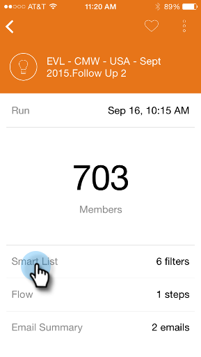

# Informazioni sulle schede per campagne avanzate {#understanding-smart-campaign-cards}

Utilizza Marketo Moments per visualizzare ogni esecuzione delle campagne intelligenti dal tuo smartphone o iPad. La smart card Moments di Marketo rappresenta una singola esecuzione di una campagna; viene visualizzata una nuova smart card ogni volta che la smart campaign viene eseguita. Le smart campaign card sono contrassegnate da una lampadina in alto a sinistra.

Per le future campagne intelligenti pianificate ma non ancora eseguite, la scheda Marketo Moments non mostra ancora alcuno stato della campagna. Verranno visualizzati in una versione futura.

## Schede Smart Campaign {#smart-campaign-cards}

1. Tocca la scheda per aprire la scheda dei dettagli.

   

1. La scheda dei dettagli consente di accedere alle informazioni sui filtri Elenco avanzato, Flusso e Riepilogo e-mail.

1. Tocca **Elenco avanzato**.

   

1. I filtri utilizzati dall’elenco avanzato sono mostrati qui.

   

1. Tocca **Flusso**.

   

1. Ora vedrai il flusso di Smart Campaign. Questa campagna ha un solo passaggio di flusso, ma possono esserci più passaggi.

   

1. Clic **Riepilogo e-mail**.

   

1. Ora puoi vedere la risposta dei destinatari a ogni e-mail, per numero e percentuale.

   

1. Vedi quei due punti in basso? Indicano che ci sono due e-mail connesse a questa campagna intelligente. Per visualizzare i risultati per l’altra e-mail, scorri lo schermo verso sinistra. Ecco i risultati della seconda e-mail.

   

   >[!NOTE]
   >
   >L&#39;altro punto è ora evidenziato.

## Creazione di esempi e anteprime e-mail {#creating-email-samples-and-previews}

È consigliabile dare un’occhiata a un’e-mail prima che venga inviata. Oppure, inviate un campione a qualcun altro per avere un secondo sguardo su di esso.

1. Tocca il menu di azioni a tre punti su un’e-mail.

   

1. Tocca [Invia esempio](/help/marketo/product-docs/core-marketo-concepts/mobile-apps/marketo-moments/working-with-moments/sending-a-sample.md) o [Anteprima e-mail](/help/marketo/product-docs/core-marketo-concepts/mobile-apps/marketo-moments/working-with-moments/previewing-an-email.md) (fare clic su questi collegamenti per visualizzare i dettagli).

   

## Conferma dell’esecuzione di una campagna avanzata {#confirming-a-smart-campaign-run}

Le schede per le campagne intelligenti non confermate sono grigie fino a quando non le confermi. Poi diventano arancioni.

1. Per confermare una smart card non confermata, tocca il menu Azioni con tre punti.

   

1. Tocca **Conferma**.

   

1. Tocca **Conferma** per terminare il lavoro, oppure **Non importa** se ha dei ripensamenti.

   

   >[!NOTE]
   >
   >Ora la tua carta diventerà arancione!

## Annullamento di un’esecuzione di una campagna avanzata {#canceling-a-smart-campaign-run}

Puoi annullare un’esecuzione confermata e pianificata di una campagna intelligente.

1. Tocca il menu Azioni con tre punti.

   

1. Tocca **Annulla esecuzione**.

   

1. Tocca **Annulla esecuzione**. Se decidi all’ultimo minuto di non annullare l’esecuzione, tocca **Non importa** e la campagna intelligente verrà eseguita come pianificato.

   

## Riprogrammazione di una campagna avanzata {#rescheduling-a-smart-campaign}

Puoi ripianificare una campagna avanzata confermata che non è ancora stata eseguita.

1. Tocca il menu Azioni con tre punti.

   

1. Tocca **Riprogramma**.

   

1. Seleziona una data nel calendario e tocca **Riprogramma**.

   

   Un pezzo di torta!

## Altre azioni di Smart Campaign {#other-smart-campaign-actions}

Come per altre schede Marketo Moments, puoi toccare i tre punti su qualsiasi scheda Smart Campaign o scheda dettagli per:

* [Imposta come preferito](/help/marketo/product-docs/core-marketo-concepts/mobile-apps/marketo-moments/working-with-moments/creating-a-favorite.md)
* [Contrassegna come completato](/help/marketo/product-docs/core-marketo-concepts/mobile-apps/marketo-moments/working-with-moments/marking-it-done.md)
* [Condividi](/help/marketo/product-docs/core-marketo-concepts/mobile-apps/marketo-moments/working-with-moments/sharing-a-moment.md)

>[!NOTE]
>
>Puoi anche toccare il **Condividi** su una scheda di Smart Campaign da condividere e il **Fine** e **Preferito** icone nella scheda dei dettagli.

## Eliminare rapidamente una smart card di una campagna {#quickly-delete-a-smart-campaign-card}

Se si dispone di una scheda che non è più necessaria, ad esempio quella utilizzata per i test, è possibile eliminarla rapidamente scorrendo verso sinistra o verso destra.
