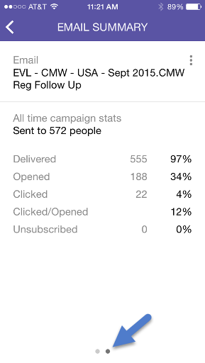

# Informazioni sulle schede di Smart Campaign {#understanding-smart-campaign-cards}

Utilizza Marketo Moments per visualizzare ogni esecuzione delle campagne intelligenti dallo smart phone o dall’iPad. La smart card Marketo Moments rappresenta una singola esecuzione di una campagna; a ogni esecuzione della campagna intelligente viene visualizzata una nuova scheda. Le schede smart della campagna sono contrassegnate da una lampadina in alto a sinistra.

Per le campagne avanzate future pianificate ma non ancora eseguite, la scheda Marketo Moments non visualizza ancora i dati delle campagne. Verranno visualizzate in una versione futura.

## Schede di Smart Campaign {#smart-campaign-cards}

1. Toccate la scheda per aprire la scheda dei dettagli.

   

1. La scheda dei dettagli consente di accedere alle informazioni sui filtri dell’elenco avanzato, sul flusso e sul riepilogo e-mail.

1. Tocca **Elenco avanzato**.

   

1. I filtri utilizzati dall’elenco avanzato sono mostrati qui.

   

1. Tocca **Flusso**.

   

1. Ora vedrai il flusso della Smart Campaign. Questa campagna ha un solo passaggio di flusso, ma possono esserci più passaggi.

   

1. Fai clic su **Riepilogo e-mail**.

   

1. Ora puoi visualizzare la risposta del destinatario a ogni e-mail, per numero e percentuale.

   

1. Vedete quei due punti in basso? Indicano che ci sono due e-mail connesse a questa campagna intelligente. Per visualizzare i risultati dell’altro messaggio e-mail, scorri lo schermo verso sinistra. Di seguito sono riportati i risultati della seconda e-mail.

   

   >[!NOTE]
   >
   >L’altro punto viene ora evidenziato.

## Creazione di esempi e anteprime di e-mail {#creating-email-samples-and-previews}

È una buona idea dare un&#39;occhiata a un&#39;e-mail prima che esca. Oppure, mandate un campione a qualcun altro per farci un secondo gruppo di occhi.

1. Tocca il menu delle azioni a tre punti in un messaggio e-mail.

   

1. Tocca [Invia campione](/help/marketo/product-docs/core-marketo-concepts/mobile-apps/marketo-moments/working-with-moments/sending-a-sample.md) o [Anteprima e-mail](/help/marketo/product-docs/core-marketo-concepts/mobile-apps/marketo-moments/working-with-moments/previewing-an-email.md) (fai clic su questi collegamenti per ulteriori dettagli).

   

## Conferma dell’esecuzione di una campagna avanzata {#confirming-a-smart-campaign-run}

Le schede per le campagne avanzate non confermate sono grigie fino a quando non le confermi. Poi diventano arancioni.

1. Per confermare una smart card non confermata, tocca il menu delle tre azioni dei punti.

   

1. Tocca **Conferma**.

   

1. Tocca **Conferma** per completare il lavoro, oppure **Non fare attenzione** in caso di ripensamenti.

   

   >[!NOTE]
   >
   >Ora la tua carta diventerà arancione!

## Annullamento dell’esecuzione di una campagna avanzata {#canceling-a-smart-campaign-run}

È possibile annullare un&#39;esecuzione confermata di una campagna intelligente pianificata.

1. Tocca il menu delle tre azioni dei punti.

   

1. Tocca **Annulla esecuzione**.

   

1. Tocca **Annulla esecuzione**. Se decidi all’ultimo minuto di non annullare l’esecuzione, tocca **Never Mind** e la campagna intelligente verrà eseguita come pianificato.

   

## Riprogrammazione di una campagna avanzata {#rescheduling-a-smart-campaign}

Puoi ripianificare una campagna avanzata confermata non ancora eseguita.

1. Tocca il menu delle tre azioni dei punti.

   

1. Tocca **Riprogramma**.

   

1. Seleziona una data sul calendario e tocca **Riprogramma**.

   

   Pezzo di torta!

## Altre azioni di Smart Campaign {#other-smart-campaign-actions}

Come per le altre schede Marketo Moments, puoi toccare i tre punti su qualsiasi scheda Smart Campaign o scheda dei dettagli per:

* [Farlo diventare un preferito](/help/marketo/product-docs/core-marketo-concepts/mobile-apps/marketo-moments/working-with-moments/creating-a-favorite.md)
* [Segna fatto](/help/marketo/product-docs/core-marketo-concepts/mobile-apps/marketo-moments/working-with-moments/marking-it-done.md)
* [Condividi](/help/marketo/product-docs/core-marketo-concepts/mobile-apps/marketo-moments/working-with-moments/sharing-a-moment.md)

>[!NOTE]
>
>Puoi anche toccare l’icona **Condividi** su una scheda Smart Campaign da condividere, e le icone **Fine** e **Preferito** sulla scheda dei dettagli.

## Eliminazione rapida di una scheda di Smart Campaign {#quickly-delete-a-smart-campaign-card}

Se si dispone di una scheda di cui non si ha più bisogno, forse di una carta utilizzata per il test, è possibile sbarazzarsene con un rapido scorrimento a sinistra o a destra.
