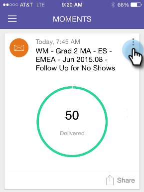

# Creare un preferito {#creating-a-favorite}

Preferisci una scheda per un facile riferimento futuro.

>[!IMPORTANT]
>
>Il 2 ottobre 2023, Adobe ha rimosso l’app Marketo Moments da tutti gli app store. Se l&#39;app è già installata sul tuo tablet/dispositivo mobile, puoi continuare a utilizzarla per il momento. Una volta migrata l’istanza Marketo Engage ad Adobe Identity per l’autenticazione di Marketo, non potrai più accedere all’app. [Ulteriori informazioni](https://nation.marketo.com/t5/product-discussions/marketo-events-app-and-marketo-moments-app-end-of-life/m-p/340712/highlight/true#M193869){target="_blank"}.

1. Apri il menu Scheda.

   

1. Toccare **[!UICONTROL Favorite]**.

   
