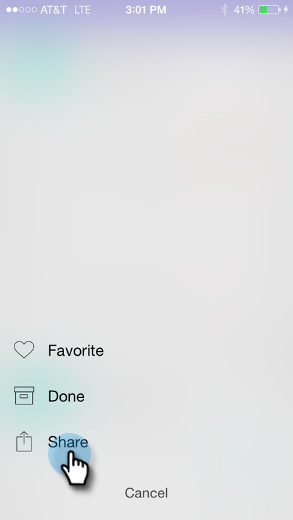

# Condivisione di un momento {#sharing-a-moment}

Vuoi fornire un aggiornamento al tuo team? Sono disponibili due opzioni per selezionare la condivisione:

1. Tocca il **Condividi** sulla scheda.

   

1. Tocca il menu della scheda e tocca **Condividi** nella schermata Dettagli.

   

   

1. Seleziona la modalità di condivisione. Passiamo all&#39;e-mail.

   >[!NOTE]
   >
   >La condivisione dipende dalle app installate sul telefono. Quindi, se non avete Facebook, non lo vedrete in Momenti.

   

1. Inserisci l’indirizzo del destinatario, un oggetto e tocca **Invia**.

   

   Ottimo lavoro!
