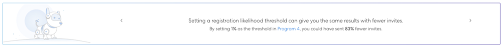

# Informazioni sul tracciamento degli obiettivi e sulle registrazioni previste {#understanding-goal-tracking-and-projected-registrations}

Ecco come tracciare il progresso del tuo obiettivo e comprendere le previsioni di Marketo.

>[!PREREQUISITES]
>
>Per accedere alla maggior parte di queste funzioni, assicurati di abilitare il [interruttore di nuova generazione](/help/marketo/product-docs/marketo-engage-modern-ux/toggle-switch.md){target=&quot;_blank&quot;} per i programmi evento.

>[!NOTE]
>
>Quando un programma evento viene creato nell&#39;esperienza Marketo Classic, la data di inizio dell&#39;evento viene impostata automaticamente sulla data di creazione dell&#39;evento. Poiché le registrazioni previste tengono conto della quantità di tempo precedente alla data di inizio di un evento, questi numeri potrebbero non essere precisi se la data di inizio e la data di creazione sono uguali (a meno che non siano impostati intenzionalmente).

## Tracciamento degli obiettivi e registrazioni previste

1. Puoi trovare i dettagli di tracciamento dell’obiettivo nella sezione **[!UICONTROL Reports]** scheda del programma dell’evento. In questo particolare esempio, finora vi sono 150 iscritti contro un obiettivo di 200 (75%).

   

Vedrai anche il tuo **[!UICONTROL Projected]** registrazioni. Passa il puntatore sull’icona delle informazioni per visualizzare una suddivisione di questo numero per segmento di probabilità.

>[!NOTE]
>
>Il grafico Partecipante e Superiore rimarrà vuoto fino al giorno dell’evento.

Se l’interruttore di attivazione non è stato attivato, verrà visualizzato nell’interfaccia utente di Marketo Class:

1. Fare clic sull&#39;interruttore Grafico per passare a un raggruppamento dei membri in base alla probabilità di registrazione. Verranno visualizzate le percentuali di registrazione correnti per ciascun segmento, rispetto alla percentuale media per quel segmento nei programmi passati.

   

Tutti i membri (registrati e non ancora registrati) sono classificati in base alla loro probabilità di registrazione. Passa il puntatore sull’icona delle informazioni per vedere come vengono definite queste categorie di probabilità.

>[!NOTE]
>
>I numeri di previsione vengono aggiornati ogni 24 ore fino al giorno dell’evento. Tutti i membri elencati come _Elaborazione_ saranno inclusi nel successivo ciclo di calcolo.

## Programmi simili

Puoi ottenere informazioni sull’evento corrente analizzando le prestazioni di programmi simili in passato. Questa sezione mostra fino a 5 programmi simili degli ultimi 6 mesi, con il numero/percentuale di membri che erano _Registrato_ o superiore.

Nel calcolo di programmi simili, includiamo, tra gli altri, i seguenti fattori:

* Tipo di programma
* Canale del programma
* Dimensione pubblico
* Tag del programma
* Durata del tempo dalla creazione dell’evento all’inizio dell’evento
* Durata dell&#39;evento

   

## Recommendations

Nella parte superiore della pagina Rapporti puoi trovare consigli basati su AI/ML in base ai tuoi progressi. Controlla periodicamente suggerimenti utili e informazioni utili!

## Previsioni a livello di persona

Fai clic sul pulsante **[!UICONTROL Members]** per visualizzare tutti i membri del programma. Passa il puntatore del mouse **[!UICONTROL Registration Likelihood]** o **[!UICONTROL Attendance Likelihood]** barre per visualizzare le percentuali esatte e le classificazioni. È quindi possibile intervenire sui membri di una determinata categoria (ad esempio, tutti nella categoria &quot;Meno probabile&quot; di registrare), e specificatamente mirarli per aumentare potenzialmente i numeri di registrazione.

>[!NOTE]
>
>La probabilità individuale tiene conto di più di 40 fattori di persona, tra cui gli attributi del profilo, l’attività della persona e le attività precedenti invitate/registrate/frequentate.

## Domande frequenti

**D: Qual è il segmento?**

R: È probabile che la registrazione sia un valore compreso tra 0 e 100. Ogni persona che è membro del programma dell&#39;evento avrà un valore di probabilità compreso tra 0-100.

Inseriamo i valori di probabilità in tre segmenti:

* Probabilità di registrazione >50% = segmento altamente probabile
* Probabilità di registrazione da >25% a &lt;50% = probabile segmento
* Probabilità di registrazione &lt;25% = segmento meno probabile

Quando una persona ha la probabilità di registrarsi, la previsione rientrerà in uno di questi segmenti (ogni persona che è membro di un programma rientrerà in uno di essi). Ad esempio, se un programma di eventi ha 1000 membri in base alle previsioni di probabilità, questi 1000 verranno distribuiti in _Molto probabile_, _Probabile_ oppure _Meno probabile_ segmenti.

Pertanto, le persone che rientrano nel segmento Altamente probabile avranno maggiori possibilità di registrarsi per l&#39;evento.

Conversione in registrazione = numero di persone nel segmento registrato diviso per numero di persone che rientrano nel segmento (ad esempio, se 100 persone rientrano nel segmento con probabilità elevata e 60 si registrano, il tasso di conversione è del 60%).

La percentuale di conversione da registrare seguirà questo modello: Molto probabilmente > Probabilmente > Meno probabile.

**D: Come si utilizzano le informazioni approfondite?**

R: La best practice prevede quanto segue:

i. Puoi creare un programma e quindi una campagna avanzata utilizza filtri predittivi con &quot;maggiore di X&quot;, che determinerebbero una certa quantità di persone (diciamo 1000) ed esegui la campagna.

ii) Dopo 24 ore, nella [!UICONTROL Reports] è possibile visualizzare le registrazioni previste calcolate in base alla probabilità di registrare i valori di tutte le persone attualmente invitate.

iii) Se le registrazioni previste sono inferiori all&#39;obiettivo, dovresti invitare più persone. A questo punto, potete vedere le intuizioni che vi dicono qual era la soglia che funzionava nei programmi passati.

IV. Puoi creare una nuova Smart Campaign con tale soglia per invitare più persone.

v. In qualsiasi momento, se desideri comprendere il motivo per cui viene visualizzato un numero proiettato, puoi alternare per visualizzare la distribuzione del pubblico tra i segmenti, i tassi di conversione da questi ottenuti e applicare tali tassi di conversione al pubblico corrente (vedi la schermata seguente).

**D: Qual è il grafico Segmenti per registrazione?**

R: Tre barre, ciascuna delle quali rappresenta un segmento (molto probabile, probabile, meno probabile).

**Linea punteggiata viola:** Tasso medio di conversazione per la registrazione in quel segmento, in base a programmi simili passati.

**Barra blu:** Percentuale di registrazione di tutte le persone in quel segmento.

Ad esempio, supponiamo che 100 persone abbiano probabilità di registrarsi a un numero superiore al 50% e che 60 di queste 100 persone siano registrate. Molto probabilmente presenta una conversione del 60%. Quindi, tutti i membri aggiunti al programma hanno la probabilità di registrare i valori, poi vengono inseriti in segmenti e in base al numero di persone registrate in ogni tasso di conversione di segmento viene calcolato.

**D: Cosa significa &quot;Registrato e superiore&quot;?**

R: Qualsiasi persona indicata come registrata o qualsiasi altro stato con un numero di gradino uguale o superiore.

È possibile creare nuovi stati di progressione per un programma di eventi, ma tali stati vengono mappati con stati standard. Considera un caso in cui una persona viene spostata da un invitato a un promemoria, che è un passaggio più alto della registrazione. Questa persona verrà anche considerata come registrata e mostrata nel tracciamento dell’obiettivo.

**D: Come vengono calcolate le registrazioni previste?**

R: Vedi sotto.

