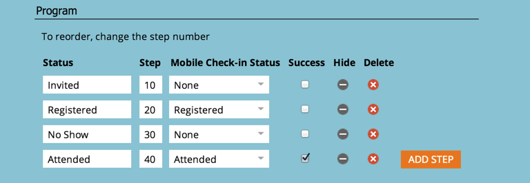

# Informazioni sull’iscrizione al programma {#understanding-program-membership}

>[!NOTE]
>
>**Definizione:** Un membro è una persona con uno stato in un programma.

## Come le persone diventano membri di un programma {#how-people-become-members-of-a-program}

1. Una persona compila un modulo [in una pagina di destinazione](/help/marketo/getting-started/quick-wins/landing-page-with-a-form.md){target="_blank"} nel programma.

   * La persona avrà automaticamente il primo stato nella progressione.

1. [importa membri nel programma](/help/marketo/product-docs/core-marketo-concepts/programs/working-with-programs/import-members-from-a-spreadsheet-into-a-program.md){target="_blank"} da un file CSV.

   * La persona avrà automaticamente il primo stato nella progressione.

1. Utilizza il passaggio di flusso [cambia stato del programma](/help/marketo/product-docs/core-marketo-concepts/smart-campaigns/program-flow-actions/change-program-status.md){target="_blank"}.
1. Una persona si registra o partecipa a un [webinar sincronizzato con un programma eventi](/help/marketo/product-docs/demand-generation/events/understanding-events/event-partners.md){target="_blank"}.
1. Creazione di una persona [tramite l&#39;applicazione di archiviazione Marketo iPad](/help/marketo/product-docs/core-marketo-concepts/mobile-apps/event-check-in/check-people-into-your-event-from-your-tablet.md){target="_blank"}.
1. Una persona viene aggiunta a una campagna SFDC, che è [sincronizzata con il programma](/help/marketo/product-docs/crm-sync/salesforce-sync/sfdc-sync-details/sfdc-sync-campaign-sync.md){target="_blank"}.

>[!NOTE]
>
>Per un programma e-mail, una persona viene aggiunta all’iscrizione solo quando l’e-mail viene inviata.

## Stati dei programmi {#program-statuses}

Gli stati del programma sono i passaggi che le persone seguono in un programma (ad esempio Invitato, Confermato, Partecipato, No Show). Questi passaggi sono definiti dal [canale](/help/marketo/product-docs/administration/tags/create-a-program-channel.md){target="_blank"}.

>[!NOTE]
>
>Una persona non può tornare indietro a uno stato di programma precedente. La progressione dello stato è unidirezionale.

## Stati di successo {#success-statuses}

Lo scopo di un programma è quello di creare un’interazione significativa con la persona o il potenziale cliente. Il successo è contrassegnato quando una persona raggiunge lo stato che raggiunge tale obiettivo.

>[!NOTE]
>
>Per un webinar, la registrazione non è un&#39;interazione significativa se non guardano effettivamente il webinar. In questo caso, partecipare è un successo.

## Programma di acquisizione {#acquisition-program}

Quando un nuovo nome entra nel sistema come membro del programma, Marketo imposta automaticamente tale programma come &quot;acquisizione&quot;.

>[!MORELIKETHIS]
>
>* [Utilizzare i tag in un programma](/help/marketo/product-docs/core-marketo-concepts/programs/working-with-programs/use-tags-in-a-program.md){target="_blank"}
>* [Crea un report sulle prestazioni del programma](/help/marketo/product-docs/core-marketo-concepts/programs/program-performance-report/create-a-program-performance-report.md){target="_blank"}
