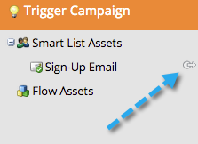

# Utilizzare la scheda Risorse {#using-the-assets-tab}

L’area di lavoro delle risorse è una rappresentazione visiva del programma predefinito o dell’evento. Puoi utilizzarlo per aggiungere risorse locali e interagire con quelle esistenti.

## Aggiunta di Assets {#adding-assets}

Fare clic sulla scheda **[!UICONTROL Assets]** nel programma desiderato. Scegli una delle risorse seguenti e aggiungile al programma.

## Gestione del programma  {#manage-your-program}

Quando il programma contiene delle risorse, le visualizzerai in questo elenco.

| Arancione | Campagna trigger |
|---|---|
| Verde | Campagna batch |

Puoi fare clic con il pulsante destro del mouse sull’intestazione se desideri interagire con tale risorsa.

>[!TIP]
>
>Trascina per ridisporre le colonne della risorsa.

Assets che non sono locali per il programma sarà simile al seguente:

La scheda Risorse è una piccola dashboard perfetta per tutto ciò che contiene e a cui si fa riferimento nel programma.
