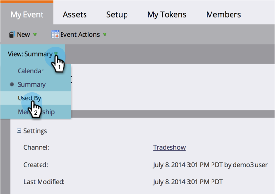

# Utilizzo della scheda Pagina iniziale del programma {#using-the-program-home-tab}

La scheda home del programma offre una visualizzazione di alto livello di ciò che accade nel programma.

## Visualizzazione riepilogo {#summary-view}

1. Vai a **Attività di marketing**.

   

1. Selezionare un programma.

   

   >[!NOTE]
   >
   >Questa è la visualizzazione predefinita. Fornisce informazioni sulle impostazioni, la pianificazione, i risultati e lo stato del programma dei membri.

1. Fai clic su elementi sottolineati per apportare modifiche o visualizzare ulteriori informazioni.

   

1. Fai clic su **Esporta** nella parte inferiore del report di riepilogo per scaricare il report.

   

## Utilizzato da View {#used-by-view}

1. In Attività di marketing, seleziona un programma.

   

1. Fai clic sul menu a discesa **Visualizza** . Selezionare **Utilizzato da**.

   

   Questa visualizzazione mostra le campagne intelligenti in uso.

   

## Visualizzazione appartenenza {#membership-view}

1. In Attività di marketing, seleziona un programma.

   

1. Fai clic sul menu a discesa **Visualizza** . Selezionare **Appartenenza**.

   

   Questo grafico mostra dove si trovano i membri mentre si spostano tra gli stati del programma.

   

   >[!NOTE]
   >
   >**** Historically indica chiunque abbia mai seguito il programma, mentre  **** Currentonly include persone attualmente nel programma.

   >[!MORELIKETHIS]
   >
   >[Informazioni sull’appartenenza al programma](/help/marketo/product-docs/core-marketo-concepts/programs/creating-programs/understanding-program-membership.md)
