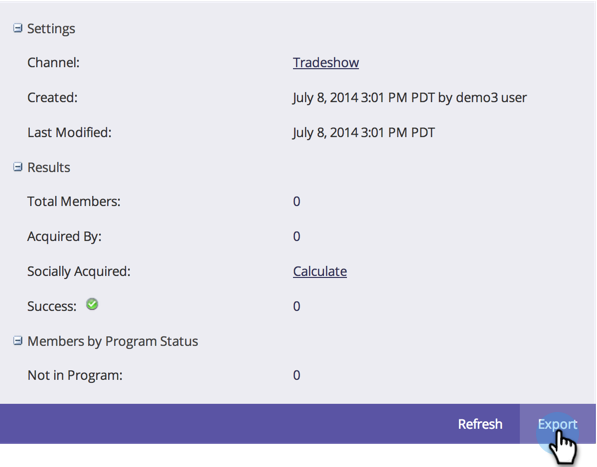
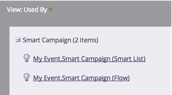

# Utilizzare la scheda Home del programma {#using-the-program-home-tab}

La scheda Home del programma offre una panoramica generale di ciò che accade nel programma.

## Visualizzazione Riepilogo {#summary-view}

1. Passa a **[!UICONTROL Marketing Activities]**.

   

1. Seleziona un programma.

   

   >[!NOTE]
   >
   >Questa è la vista predefinita. Fornisce informazioni sullo stato del programma Impostazioni, Pianificazione, Risultati e Membri.

1. Fai clic su elementi sottolineati per apportare modifiche o visualizzare ulteriori informazioni.

   

1. Fare clic su **[!UICONTROL Export]** nella parte inferiore del report Riepilogo per scaricare il report.

   

## Utilizzato dalla vista {#used-by-view}

1. In **[!UICONTROL Marketing Activities]**, selezionare un programma.

   

1. Fare clic sul menu a discesa **[!UICONTROL View]**. Seleziona **[!UICONTROL Used By]**.

   

   Questa visualizzazione mostra cosa sono le campagne avanzate in uso.

   

## Visualizzazione appartenenza {#membership-view}

1. In **[!UICONTROL Marketing Activities]**, selezionare un programma.

   

1. Fare clic sul menu a discesa **[!UICONTROL View]**. Seleziona **[!UICONTROL Membership]**.

   

   Questo grafico mostra dove si trovano i membri mentre passano attraverso gli stati del programma.

   

   >[!NOTE]
   >
   >**[!UICONTROL Historical]** indica chiunque abbia mai eseguito il programma, mentre **[!UICONTROL Current]** include solo le persone attualmente nel programma.

   >[!MORELIKETHIS]
   >
   >[Informazioni sull’iscrizione a un programma](/help/marketo/product-docs/core-marketo-concepts/programs/creating-programs/understanding-program-membership.md){target="_blank"}
