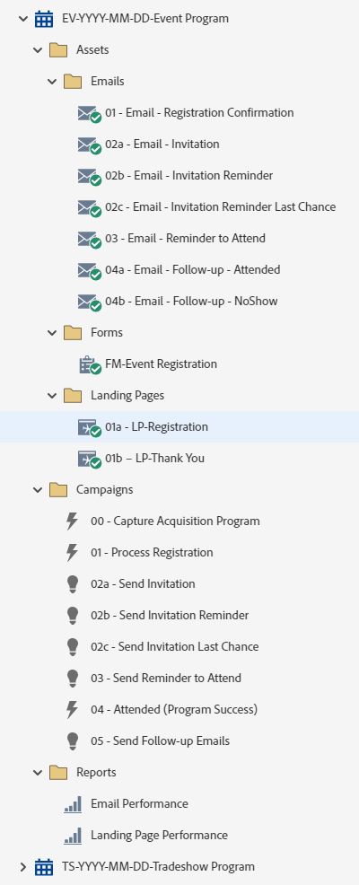

# Programma Evento EV-YYY-MM-DD {#ev-yyyy-mm-dd-event-program}

Questo è un esempio di un programma di eventi con una pagina di registrazione, tre e-mail di invito e messaggi e-mail di follow-up che utilizzano un programma di eventi di Marketo Engage. Adatto per tutti gli eventi per i quali è necessaria la registrazione, inclusi eventi itineranti, pranzi, cene o presentazioni durante le fiere.

Per ulteriore assistenza sulla strategia o per personalizzare un programma, contatta il team dell’account Adobe o visita il [Adobe Professional Services](https://business.adobe.com/customers/consulting-services/main.html){target="_blank"} pagina.

## Riepilogo canale {#channel-summary}

<table style="table-layout:auto"> 
 <tbody> 
  <tr> 
   <th>Canale</th> 
   <th>Stato iscrizione</th>
   <th>Comportamento di Analytics</th>
   <th>Tipo di programma</th>
  </tr> 
  <tr> 
   <td>Evento</td> 
   <td>01 - Invitato 
 02-In lista d’attesa
 03-Registrato
 04-Nessuno spettacolo
 05-Partecipated-Success</td>
   <td>Inclusivo</td>
   <td>Evento</td>
  </tr>
 </tbody> 
</table>

## Il programma contiene le seguenti risorse {#program-contains-the-following-assets}

<table style="table-layout:auto"> 
 <tbody> 
  <tr> 
   <th>Tipo</th> 
   <th>Nome modello</th>
   <th>Nome risorsa</th>
  </tr> 
  <tr> 
   <td>E-mail</td> 
   <td><a href="/help/marketo/product-docs/core-marketo-concepts/programs/program-library/quick-start-email-template.md" target="_blank">Modello e-mail di avvio rapido</a></td>
   <td>01-E-Mail-Grazie</td>
  </tr>
   <tr> 
   <td>E-mail</td> 
   <td><a href="/help/marketo/product-docs/core-marketo-concepts/programs/program-library/quick-start-email-template.md" target="_blank">Modello e-mail di avvio rapido</a></td>
   <td>02a- E-mail - invito</td>
  </tr>
  <tr> 
   <td>E-mail</td> 
   <td><a href="/help/marketo/product-docs/core-marketo-concepts/programs/program-library/quick-start-email-template.md" target="_blank">Modello e-mail di avvio rapido</a></td>
   <td>02b - E-mail - Promemoria invito</td>
  </tr>
  <tr> 
   <td>E-mail</td> 
   <td><a href="/help/marketo/product-docs/core-marketo-concepts/programs/program-library/quick-start-email-template.md" target="_blank">Modello e-mail di avvio rapido</a></td>
   <td>02c- E-mail - Promemoria invito Ultima possibilità</td>
  </tr>
  <tr> 
   <td>E-mail</td> 
   <td><a href="/help/marketo/product-docs/core-marketo-concepts/programs/program-library/quick-start-email-template.md" target="_blank">Modello e-mail di avvio rapido</a></td>
   <td>03 - E-mail - Promemoria per la partecipazione</td>
  </tr>
  <tr> 
   <td>E-mail</td> 
   <td><a href="/help/marketo/product-docs/core-marketo-concepts/programs/program-library/quick-start-email-template.md" target="_blank">Modello e-mail di avvio rapido</a></td>
   <td>04a - E-mail - Seguito - Partecipazione avvenuta</td>
  </tr>
  <tr> 
   <td>E-mail</td> 
   <td><a href="/help/marketo/product-docs/core-marketo-concepts/programs/program-library/quick-start-email-template.md" target="_blank">Modello e-mail di avvio rapido</a></td>
   <td>04b - E-mail - Follow-up - NoShow</td>
  </tr>
  <tr> 
   <td>Pagina di destinazione</td> 
   <td><a href="/help/marketo/product-docs/core-marketo-concepts/programs/program-library/quick-start-landing-page-template.md" target="_blank">Modello di programma di apprendimento rapido</a></td>
   <td>01a - LP - Registrazione</td>
  </tr>
  <tr> 
   <td>Pagina di destinazione</td> 
   <td><a href="/help/marketo/product-docs/core-marketo-concepts/programs/program-library/quick-start-landing-page-template.md" target="_blank">Modello di programma di apprendimento rapido</a></td>
   <td>01b - LP - Grazie</td>
  </tr>
  <tr> 
   <td>Modulo</td> 
   <td> </td>
   <td>Registrazione evento FM</td>
  </tr>
  <tr> 
   <td>Rapporto locale</td> 
   <td> </td>
   <td>Prestazioni e-mail</td>
  </tr>
  <tr> 
   <td>Rapporto locale</td> 
   <td> </td>
   <td>Prestazioni della pagina di destinazione</td>
  </tr>
  <tr> 
   <td>Campagna avanzata</td> 
   <td> </td>
   <td>00 - Acquisizione del programma</td>
  </tr>
  <tr> 
   <td>Campagna avanzata</td> 
   <td> </td>
   <td>01 - Registrazione processo</td>
  </tr>
   <tr> 
   <td>Campagna avanzata</td> 
   <td> </td>
   <td>02a - Invia invito</td>
  </tr>
   <tr> 
   <td>Campagna avanzata</td> 
   <td> </td>
   <td>02b - Invia promemoria invito</td>
  </tr>
   <tr> 
   <td>Campagna avanzata</td> 
   <td> </td>
   <td>02c - Invia invito ultima possibilità</td>
  </tr>
   <tr> 
   <td>Campagna avanzata</td> 
   <td> </td>
   <td>03 - Invia promemoria per partecipare</td>
  </tr>
   <tr> 
   <td>Campagna avanzata</td> 
   <td> </td>
   <td>04 - Partecipazione avvenuta (programma riuscito)</td>
  </tr>
   <tr> 
   <td>Campagna avanzata</td> 
   <td> </td>
   <td>05 - Inviare e-mail di follow-up</td>
  </tr>
  <tr> 
   <td>Cartella</td> 
   <td> </td>
   <td>Assets: ospita tutte le risorse creative 
 (sottocartelle per e-mail e pagine di destinazione)</td>
  </tr>
  <tr> 
   <td>Cartella</td> 
   <td> </td>
   <td>Campagne: ospita tutte le campagne intelligenti</td>
  </tr>
  <tr> 
   <td>Cartella</td> 
   <td> </td>
   <td>Rapporti</td>
  </tr>
 </tbody> 
</table>

## I miei token inclusi {#my-tokens-included}

<table style="table-layout:auto"> 
 <tbody> 
  <tr> 
   <th>Tipo di token</th> 
   <th>Nome token</th>
   <th>Valore</th>
  </tr>
  <tr> 
   <td>File di calendario</td> 
   <td><code>{{my.AddToCalendar}}</code></td>
   <td>Doppio clic per dettagli</td>
  </tr>
  <tr> 
   <td>Testo</td> 
   <td><code>{{my.Email-FromAddress}}</code></td>
   <td>PlaceholderFrom.email@mydomain.com</td>
  </tr>
  <tr> 
   <td>Testo</td> 
   <td><code>{{my.Email-FromName}}</code></td>
   <td><code><--My From Name Here--></code></td>
  </tr>
  <tr> 
   <td>Testo</td> 
   <td><code>{{my.Email-ReplyToAddress}}</code></td>
   <td>reply-to.email@mydomain.com</td>
  </tr>
  <tr> 
   <td>Testo</td> 
   <td><code>{{my.Event-Date}}</code></td>
   <td><code><--My Event Date--></code></td>
  </tr>
   <tr> 
   <td>Rich Text</td> 
   <td><code>{{my.Content-Description}}</code></td>
   <td>Doppio clic per dettagli  
 <code><--My Content Description Here--></code> 
 Modifica questa descrizione del contenuto a livello di programma, nella scheda I miei token. 
 Imparerai: 
<li>Punto elenco 1</li>
<li>Punto elenco 2</li>
<li>Punto elenco 3</li></td>
  </tr>
  <tr> 
   <td>Testo</td> 
   <td><code>{{my.Event-Location-Line1}}</code></td>
   <td><code><--XYZ Hotel--></code></td>
  </tr>
   <tr> 
   <td>Testo</td> 
   <td><code>{{my.Event-Location-Line2}}</code></td>
   <td><code><--ABC Room--></code></td>
  </tr>
   <tr> 
   <td>Testo</td> 
   <td><code>{{my.Event-Location-Line3}}</code></td>
   <td><code><--1234 Anystreet--></code></td>
  </tr>
  <tr> 
   <td>Testo</td> 
   <td><code>{{my.Event-Location-Line4}}</code></td>
   <td><code><--Anytown, ZZ 99999--></code></td>
  </tr>
  <tr> 
   <td>Testo</td> 
   <td><code>{{my.Event-Time}}</code></td>
   <td><code><--My Event Time + TimeZone--></code></td>
  </tr>
  <tr> 
   <td>Testo</td> 
   <td><code>{{my.Event-Title}}</code></td>
   <td><code><--My Event Title Here--></code></td>
  </tr>
  <tr> 
   <td>Testo</td> 
   <td><code>{{my.Event-Type}}</code></td>
   <td>Evento live</td>
  </tr>
  <tr> 
   <td>Testo</td> 
   <td><code>{{my.PageURL-Download}}</code></td>
   <td>my.DownloadURL?without=http://</td>
  </tr>
  <tr> 
   <td>Testo</td> 
   <td><code>{{my.PageURL-Registration}}</code></td>
   <td>my.RegistrationPageURL?without=http://</td>
  </tr>
  <tr> 
   <td>Testo</td> 
   <td><code>{{my.PageURL-ThankYou}}</code></td>
   <td>my.ThankYouPageURL?without=http://</td>
  </tr>
  <tr> 
   <td>Testo</td> 
   <td><code>{{my.Speaker1-Name}}</code></td>
   <td><code><--Speaker Name Here--></code></td>
  </tr>
  <tr> 
   <td>Testo</td> 
   <td><code>{{my.Speaker1-Title}}</code></td>
   <td><code><--Speaker Title Here--></code></td>
  </tr>
  <tr> 
   <td>Testo</td> 
   <td><code>{{my.Speaker2-Name}}</code></td>
   <td><code><--Speaker Name Here--></code></td>
  </tr>
  <tr> 
   <td>Testo</td> 
   <td><code>{{my.Speaker2-Title}}</code></td>
   <td><code><--Speaker Title Here--></code></td>
  </tr>
  <tr> 
   <td>Testo</td> 
   <td><code>{{my.Speaker3-Name}}</code></td>
   <td><code><--Speaker Name Here--></code></td>
  </tr>
 <tr> 
   <td>Testo</td> 
   <td><code>{{my.Speaker3-Title}}</code></td>
   <td><code><--Speaker Title Here--></code></td>
  </tr>
 </tbody> 
</table>

## Regole di conflitto {#conflict-rules}

* **Tag del programma**
   * Crea tag in questa sottoscrizione - _Consigliato_
   * Ignora

* **Modello per pagina di destinazione con lo stesso nome**
   * Copia modello originale
   * Usa modello di destinazione - _Consigliato_

* **Immagini con lo stesso nome**
   * Mantieni entrambi i file
   * Sostituisci elemento in questa sottoscrizione - _Consigliato_

* **Modelli e-mail con lo stesso nome**
   * Mantieni entrambi i modelli
   * Sostituisci modello esistente - _Consigliato_

## Best practice {#best-practices}

* Dopo aver importato il programma del webinar, spostare il modulo da una risorsa locale a una risorsa globale disponibile in Design Studio.
   * La riduzione del numero di moduli e l’utilizzo di più risorse globali da Design Studio consentono una maggiore scalabilità nella progettazione dei programmi e nella governance amministrativa. Offre inoltre flessibilità per gli aggiornamenti regolari sulla conformità per campi, lingua di consenso, ecc.

* È consigliabile aggiornare i modelli nel programma importato per utilizzare i modelli attualmente contrassegnati con il marchio oppure aggiornare il modello appena importato in base al marchio aggiungendo uno snippet o le informazioni appropriate su logo/piè di pagina.

* Prendi in considerazione l’aggiornamento della convenzione di denominazione di questo esempio di programma per allinearla alla convenzione di denominazione.

>[!NOTE]
>
>Ricorda di aggiornare i Valori token personali nel modello di programma e ogni volta che utilizzi il programma, in base alle esigenze.

>[!TIP]
>
>Non dimenticare di attivare la campagna &quot;06 partecipanti (programma riuscito)&quot; per tenere traccia del successo. Esegui questa operazione _prima di_ il modulo è attivo e le e-mail vengono inviate.

>[!IMPORTANT]
>
>I miei token che fanno riferimento a un URL non possono contenere http:// o https:// altrimenti il collegamento non funzionerà in modo appropriato all’interno della risorsa.
