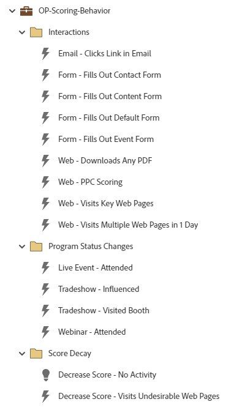

# Comportamento con punteggio OP {#op-scoring-behavior}

Questo esempio è un programma operativo avanzato (tokenizzato) per il punteggio di comportamento che utilizza un programma predefinito del Marketo Engage. Visualizza e modifica i valori di punteggio nella scheda &quot;I miei token&quot; del programma. Richiede un campo di punteggio personalizzato denominato &quot;Punteggio comportamento&quot;.

Per ulteriore assistenza sulla strategia o per personalizzare un programma, contatta il team dell’account Adobe o visita il [Adobe Professional Services](https://business.adobe.com/customers/consulting-services/main.html){target="_blank"} pagina.

## Riepilogo canale {#channel-summary}

<table style="table-layout:auto"> 
 <tbody> 
  <tr> 
   <th>Canale</th> 
   <th>Stato iscrizione</th>
   <th>Comportamento di Analytics</th>
   <th>Tipo di programma</th>
  </tr> 
  <tr> 
   <td>Operativo</td> 
   <td>01 membro</td>
   <td>Operativo</td>
   <td>Predefinito</td>
  </tr>
 </tbody> 
</table>

## Campi prerequisiti {#prerequisite-fields}

<table style="table-layout:auto"> 
 <tbody> 
  <tr> 
   <th>Tipo</th> 
   <th>Nome intuitivo</th>
   <th>Nome API</th>
  </tr>
  <tr> 
   <td>Punteggio</td> 
   <td>Punteggio comportamento</td>
   <td>PunteggioComportamento</td>
  </tr>
 </tbody> 
</table>

## Il programma contiene le seguenti risorse {#program-contains-the-following-assets}

<table style="table-layout:auto"> 
 <tbody> 
  <tr> 
   <th>Tipo</th> 
   <th>Nome modello</th>
   <th>Nome risorsa</th>
  </tr>
  <tr> 
   <td>Campagna avanzata</td> 
   <td> </td>
   <td>E-mail - Clic sul collegamento nell’e-mail</td>
  </tr>
  <tr> 
   <td>Campagna avanzata</td> 
   <td> </td>
   <td>Modulo - Compila il modulo di contatto</td>
  </tr>
  <tr> 
   <td>Campagna avanzata</td> 
   <td> </td>
   <td>Modulo: compila il modulo del contenuto</td>
  </tr>
  <tr> 
   <td>Campagna avanzata</td> 
   <td> </td>
   <td>Modulo - Compila modulo predefinito</td>
  </tr>
  <tr> 
   <td>Campagna avanzata</td> 
   <td> </td>
   <td>Modulo - Compilazione modulo evento</td>
  </tr>
  <tr> 
   <td>Campagna avanzata</td> 
   <td> </td>
   <td>Web - Download Qualsiasi PDF</td>
  </tr>
  <tr> 
   <td>Campagna avanzata</td> 
   <td> </td>
   <td>Web - PPC Scoring</td>
  </tr>
  <tr> 
   <td>Campagna avanzata</td> 
   <td> </td>
   <td>Web - Pagine Web chiave visite</td>
  </tr>
  <tr> 
   <td>Campagna avanzata</td> 
   <td> </td>
   <td>Web: visita più pagine Web in 1 giorno</td>
  </tr>
  <tr> 
   <td>Campagna avanzata</td> 
   <td> </td>
   <td>Evento live - Partecipazione avvenuta</td>
  </tr>
  <tr> 
   <td>Campagna avanzata</td> 
   <td> </td>
   <td>Tradeshow - Influenzato</td>
  </tr>
  <tr> 
   <td>Campagna avanzata</td> 
   <td> </td>
   <td>Tradeshow - Stand Visitato</td>
  </tr>
  <tr> 
   <td>Campagna avanzata</td> 
   <td> </td>
   <td>Webinar con partecipazione</td>
  </tr>
  <tr> 
   <td>Campagna avanzata</td> 
   <td> </td>
   <td>Diminuisci punteggio - Nessuna attività</td>
  </tr>
  <tr> 
   <td>Campagna avanzata</td> 
   <td> </td>
   <td>Diminuisci punteggio - Visite Pagine Web indesiderate</td>
  </tr>
  <tr> 
   <td>Cartella</td> 
   <td> </td>
   <td>Interazioni</td>
  </tr>
  <tr> 
   <td>Cartella</td> 
   <td> </td>
   <td>Modifiche stato programma</td>
  </tr>
  <tr> 
   <td>Cartella</td> 
   <td> </td>
   <td>Decadimento punteggio</td>
  </tr>
 </tbody> 
</table>

## I miei token inclusi {#my-tokens-included}

<table style="table-layout:auto"> 
 <tbody> 
  <tr> 
   <th>Tipo di token</th> 
   <th>Nome token</th>
   <th>Valore</th>
  </tr>
  <tr> 
   <td>Punteggio</td> 
   <td><code>{{my.Decrease Score - No Activity}}</code></td>
   <td>-10</td>
  </tr>
  <tr> 
   <td>Punteggio</td> 
   <td><code>{{my.Decrease Score - Visits Undesirable Web Pages}}</code></td>
   <td>-5</td>
  </tr>
  <tr> 
   <td>Punteggio</td> 
   <td><code>{{my.Email - Clicks Link}}</code></td>
   <td>+2</td>
  </tr>
   <tr> 
   <td>Punteggio</td> 
   <td><code>{{my.Form - Fills Out Contact Form}}</code></td>
   <td>+30</td>
  </tr>
  <tr> 
   <td>Punteggio</td> 
   <td><code>{{my.Form - Fills Out Content Form}}</code></td>
   <td>+15</td>
  </tr>
  <tr> 
   <td>Punteggio</td> 
   <td><code>{{my.Form - Fills Out Default Form}}</code></td>
   <td>+10</td>
  </tr>
   <tr> 
   <td>Punteggio</td> 
   <td><code>{{my.Form - Fills-out Event Form}}</code></td>
   <td>+15</td>
  </tr>
  <tr> 
   <td>Punteggio</td> 
   <td><code>{{my.Live Event - Attended}}</code></td>
   <td>+30</td>
  </tr>
   <tr> 
   <td>Punteggio</td> 
   <td><code>{{my.Tradeshow - Influenced}}</code></td>
   <td>+20</td>
  </tr>
  <tr> 
   <td>Punteggio</td> 
   <td><code>{{my.Tradeshow - Visited Booth}}</code></td>
   <td>+5</td>
  </tr>
  <tr> 
   <td>Punteggio</td> 
   <td><code>{{my.Web - Downloaded Any PDF}}</code></td>
   <td>+5</td>
  </tr>
  <tr> 
   <td>Punteggio</td> 
   <td><code>{{my.Web - PPC Scoring}}</code></td>
   <td>+15</td>
  </tr>
   <tr> 
   <td>Punteggio</td> 
   <td><code>{{my.Web - Visits Key Web Pages}}</code></td>
   <td>+5</td>
  </tr>
  <tr> 
   <td>Punteggio</td> 
   <td><code>{{my.Web - Visits Multiple Web Pages in 1 Day}}</code></td>
   <td>+5</td>
  </tr>
  <tr> 
   <td>Punteggio</td> 
   <td><code>{{my.Webinar - Attended}}</code></td>
   <td>+20</td>
  </tr>
 </tbody> 
</table>

## Regole di conflitto {#conflict-rules}

* **Tag del programma**
   * Crea tag in questa sottoscrizione - _Consigliato_
   * Ignora

* **Modello per pagina di destinazione con lo stesso nome**
   * Copia modello originale - _Consigliato_
   * Usa modello di destinazione

* **Immagini con lo stesso nome**
   * Mantieni entrambi i file - _Consigliato_
   * Sostituisci elemento in questa sottoscrizione

* **Modelli e-mail con lo stesso nome**
   * Mantieni entrambi i modelli - _Consigliato_
   * Sostituisci modello esistente

## Best practice {#best-practices}

* Ogni campagna creata deve essere un esempio della build della best practice e non specifica per i casi d’uso. Ricorda di aggiornare le campagne intelligenti per risolvere problemi specifici e problemi relativi ai dati.

* Prendi in considerazione l’aggiornamento della convenzione di denominazione di questo esempio di programma per allinearla alla convenzione di denominazione.
