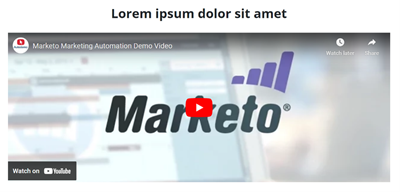

# Modello di pagina di destinazione per avvio rapido {#quick-start-landing-page-template}

Alcuni dei programmi iniziali nella Libreria di riferimento di Marketo Engage contengono un modello di pagina di destinazione semplice, facile da usare e personalizzabile che consente la creazione rapida di pagine di destinazione in una serie di casi di utilizzo di marketing.

>[!TIP]
>
>Ulteriori informazioni su [Modelli di pagina di destinazione guidata](/help/marketo/product-docs/demand-generation/landing-pages/landing-page-templates/create-a-guided-landing-page-template.md){target="_blank"}

Per ulteriore assistenza sulla strategia o per personalizzare un programma, contatta il team dell&#39;account Adobe o visita la pagina [Adobe Professional Services](https://business.adobe.com/customers/consulting-services/main.html){target="_blank"}.

## Riepilogo sezioni {#sections-summary}

### Sezione logo {#logo-section}

* Include l&#39;elemento immagine per scambiare il logo con un&#39;altra immagine
* Include le variabili da modificare:
   * Dimensione logo
   * Allineamento logo
   * Colore di sfondo per la sezione del logo
   * Mostrare o nascondere la sezione
   * Spaziatura superiore della sezione
   * Spaziatura inferiore della sezione
* 

### Sezione immagine {#image-section}

* Include l&#39;elemento immagine per scambiare il logo con un&#39;altra immagine
* Include le variabili da modificare:
   * Collegamento immagine banner
   * Larghezza banner: una delle opzioni in basso a destra consente di impostare l’immagine come larghezza del contenitore di contenuti o come larghezza dell’intero browser
   * Mostrare o nascondere la sezione
* 

### Testo a 2 colonne a sinistra, modulo a destra {#two-col-left-form-right}

* Elemento di testo titolo per aggiornare la copia titolo
* Elemento di testo paragrafo per aggiornare la copia del paragrafo
* Elemento modulo da aggiungere in un modulo
* Elemento di testo sotto il modulo per modificare il testo e i collegamenti dell’informativa sulla privacy
* Variabili da modificare:
Colore di sfondo per sezione
   * Colore di sfondo direttamente dietro al modulo
   * Raggio del bordo per il riquadro intorno al modulo (che lo rende con angoli curvi o, se impostato su &quot;0&quot;, con angoli quadrati)
   * Mostrare o nascondere l&#39;intera sezione
   * Mostrare o nascondere solo il modulo (se si nasconde il modulo, il testo nella colonna sinistra occuperà la larghezza della pagina. Può essere utilizzato per una pagina di ringraziamento o di conferma in cui non è presente un modulo.)
   * Mostrare o nascondere il testo dell&#39;informativa sulla privacy
* 

### Sezione video {#video-section}

* Elemento di testo per aggiornare il testo del titolo
* Variabili da modificare:
   * Colore di sfondo per sezione
   * Codice di incorporamento video
   * Mostra/nascondi titolo video
   * Mostra/nascondi video
* 

### Sezione piè di pagina {#footer-section}

* Elemento di testo per modificare il contenuto nella colonna sinistra
* Elemento di testo per aggiornare le icone per social network (le icone utilizzano il font FontAwesome invece delle immagini, ma possono essere sostituite con immagini).
* Variabili da modificare:
   * Colore di sfondo per sezione
   * Colore icone social
   * Mostra/nascondi sezione
* 

### Variabili aggiuntive {#additional-variables}

* **Raggio bordo pulsante**: imposta il pulsante del modulo in modo che sia arrotondato o rettangolare
* **Colore pulsante**: aggiorna il colore del pulsante nel modulo
* **Colore passaggio del mouse sul pulsante**: cambia il colore dello stato del passaggio del mouse per il pulsante nel modulo
* **Colore collegamento**: aggiorna il colore dei collegamenti nella pagina
* **Spaziatura superiore sezione**: aggiunge spazio sopra ogni sezione ad eccezione della sezione logo
* **Spaziatura inferiore sezione**: aggiunge spazio sotto ogni sezione ad eccezione della sezione logos
