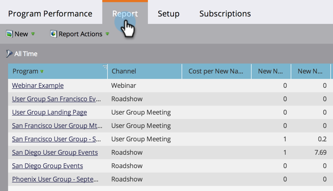

# Creare un rapporto sulle prestazioni del programma {#create-a-program-performance-report}

Con questo rapporto puoi vedere statistiche straordinarie sui tuoi programmi.

1. [Crea un report in un programma](/help/marketo/product-docs/reporting/basic-reporting/creating-reports/create-a-report-in-a-program.md){target="_blank"} e seleziona il **[!UICONTROL Tipo di report]** [Prestazioni del programma](/help/marketo/product-docs/reporting/basic-reporting/report-types/report-type-overview.md){target="_blank"}.
1. Fare clic sulla scheda **[!UICONTROL Report]**.
1. Ci sei! Esplora il tuo rapporto per vedere come stanno andando i tuoi programmi.

   

>[!TIP]
>
>Per trovare i programmi con il *Costo per completamento* più basso, ad esempio, [ordinare il report](/help/marketo/product-docs/reporting/basic-reporting/editing-reports/sort-report-on-columns.md){target="_blank"} in tale colonna e scegliere **[!UICONTROL Ordinamento crescente]**.

Le colonne di un rapporto Prestazioni programma includono:

<table> 
 <thead> 
  <tr> 
   <th>Colonna</th> 
   <th>Descrizione</th> 
  </tr> 
 </thead> 
 <tbody> 
  <tr> 
   <td>Canale</td> 
   <td>Tipo di canale del programma.</td> 
  </tr> 
  <tr> 
   <td>Nuovi nomi</td> 
   <td>Nuove persone acquisite dal programma.</td> 
  </tr> 
  <tr> 
   <td>Operazione riuscita</td> 
   <td>Numero di membri che hanno raggiunto il successo come definito negli stati del programma. </td> 
  </tr> 
  <tr> 
   <td>Costo totale</td> 
   <td>
Somma di tutti i costi del periodo all'interno del programma.
</td> 
  </tr> 
 </tbody> 
</table>
