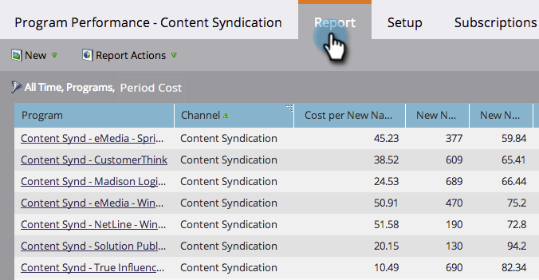

# Filtrare un rapporto Programma per costo periodo {#filter-a-program-report-by-period-cost}

Metti a fuoco [rapporto prestazioni programma](/help/marketo/product-docs/core-marketo-concepts/programs/program-performance-report/create-a-program-performance-report.md) su un periodo specifico di costo.

1. Vai a **Attività di marketing** (o **Analytics**).

   

1. Selezionare il report sulle prestazioni del programma.

   

1. Fai clic su **Configurazione** e trascinate **Costo periodo**.

   

1. Inserisci il **Da** e **A** date per i costi sostenuti e fare clic su **Applica**.

   

1. Hai finito! Fai clic su **Report** per visualizzare solo i programmi che rientrano nel periodo di tempo del costo specificato.

   

   >[!NOTE]
   >
   >[Filtrare un rapporto di programma per programma](/help/marketo/product-docs/core-marketo-concepts/programs/program-performance-report/filter-a-program-report-by-program.md)
