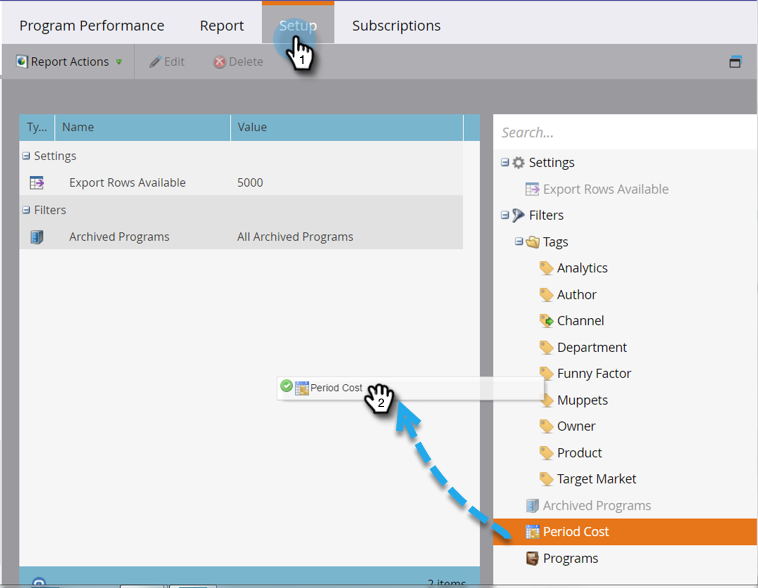

# Filtrare un rapporto del programma per costo del periodo {#filter-a-program-report-by-period-cost}

Concentrare il [report sulle prestazioni del programma](/help/marketo/product-docs/core-marketo-concepts/programs/program-performance-report/create-a-program-performance-report.md){target="_blank"} su un periodo di tempo di costo specifico.

1. Vai a **[!UICONTROL Marketing Activities]** (o **[!UICONTROL Analytics]**).

   

1. Selezionare il report sulle prestazioni del programma.

   

1. Fai clic sulla scheda **[!UICONTROL Setup]** e trascina su **[!UICONTROL Period Cost]**.

   

1. Immettere le date **[!UICONTROL From]** e **[!UICONTROL To]** per i costi sostenuti e fare clic su **[!UICONTROL Apply]**.

   

1. Hai finito! Fare clic sulla scheda **[!UICONTROL Report]** per visualizzare solo i programmi che rientrano nell&#39;intervallo di tempo di costo specificato.

   

>[!NOTE]
>
>[Filtrare un report di programma per programma](/help/marketo/product-docs/core-marketo-concepts/programs/program-performance-report/filter-a-program-report-by-program.md){target="_blank"}
