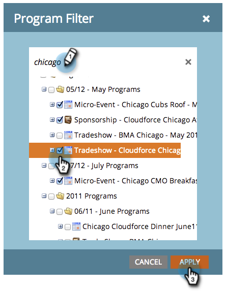

# Filtrare un rapporto di programma per programma {#filter-a-program-report-by-program}

Metti a fuoco [rapporto prestazioni programma](/help/marketo/product-docs/core-marketo-concepts/programs/program-performance-report/create-a-program-performance-report.md){target="_blank"} su programmi specifici per confrontarne le prestazioni.

1. Vai a **[!UICONTROL Attività di marketing]** (o **[!UICONTROL Analytics]**).

   

1. Selezionare il report sulle prestazioni del programma.

   

1. Fai clic su **[!UICONTROL Configurazione]** e trascinate **[!UICONTROL Programmi]**.

   

1. Scegliere le cartelle e i programmi specifici da includere nel rapporto.

   

   >[!TIP]
   >
   >Se selezioni una cartella, il rapporto includerà tutto ciò che la cartella contiene al momento dell’esecuzione del rapporto.

1. Tutto qui! Fai clic su **[!UICONTROL Report]** scheda da visualizzare _solo_ i programmi selezionati nel report.

   

>[!NOTE]
>
>[Filtrare un rapporto di programma per tag](/help/marketo/product-docs/core-marketo-concepts/programs/program-performance-report/filter-a-program-report-by-tag.md){target="_blank"}
