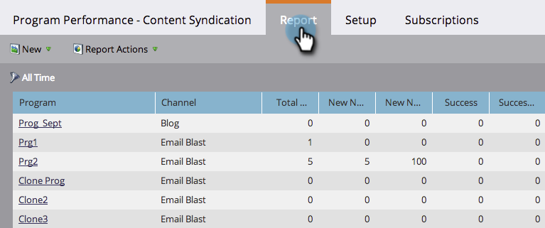

# Filtrare un rapporto del programma per tag {#filter-a-program-report-by-tag}

Attiva il rapporto [prestazioni del programma](/help/marketo/product-docs/core-marketo-concepts/programs/program-performance-report/create-a-program-performance-report.md) su [tag](/help/marketo/product-docs/core-marketo-concepts/programs/working-with-programs/understanding-tags.md) specifici.

1. Vai a **Marketing** **Attività** (o **Analytics**).

   

1. Seleziona il rapporto **Prestazioni programma** .

   

1. Fai clic sulla scheda **Configurazione** e trascina uno dei filtri **Tag** .

   

1. Scegli i valori dei tag da includere nel rapporto.

   

1. Fare clic su **Applica**.

   

1. Completato! Fai clic sulla scheda **Rapporto** per visualizzare _solo_ i programmi che corrispondono ai tag selezionati nel rapporto.

   

   >[!NOTE]
   >
   >[Filtrare un rapporto del programma per costo del periodo](/help/marketo/product-docs/core-marketo-concepts/programs/program-performance-report/filter-a-program-report-by-period-cost.md)
