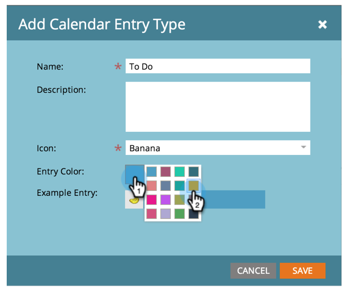

# Creare tipi di voce personalizzati {#create-custom-entry-types}

È possibile creare tipi di voce personalizzati da utilizzare nella visualizzazione Programmazione. In questo modo potrai tenere traccia di tutte le voci dell’agenda non Marketo che influiscono sul programma.

1. Andare alla sezione **[!UICONTROL Admin]** e fare clic su **[!UICONTROL Tags]**.

   

1. Fai clic su **[!UICONTROL Calendar Entry Type]**.

   

1. Fai clic sul menu a discesa **[!UICONTROL New]** e seleziona **[!UICONTROL Entry Type]**.

   

1. Assegna un nome alla voce e seleziona un&#39;icona.

   

1. Selezionare un **[!UICONTROL Entry Color]**.

   

1. Fai clic su **[!UICONTROL Save]**.

   

Ora, quando si crea una nuova voce nella vista Schedule, questo tipo sarà un&#39;opzione.

>[!NOTE]
>
>È possibile creare fino a 100 tipi di voce personalizzati.
