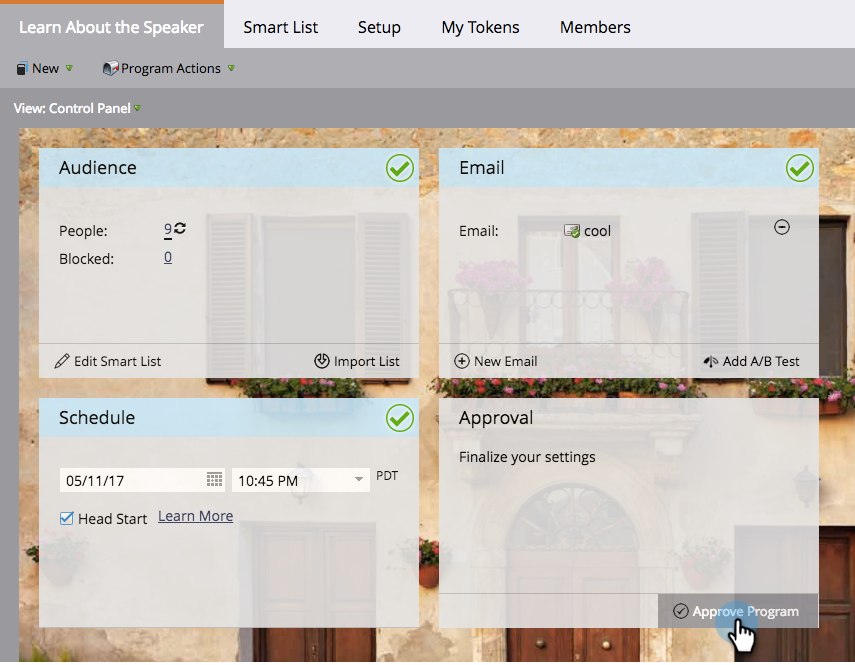

# Creazione di un nuovo programma e-mail nella vista Pianificazione {#creating-a-new-email-program-in-the-schedule-view}

È possibile creare un programma e-mail dall&#39;interno della visualizzazione della pianificazione del programma. Ecco come.

1. Vai a **Attività di marketing**.

   

1. Selezionare il programma.

   

1. Seleziona la data in cui desideri eseguire il programma e-mail.

   

1. Immetti un nome. Seleziona **Programma e-mail**.

   

1. Nei dettagli della voce, fai clic sul collegamento al nuovo programma e-mail.

   

1. [Configurare il programma e-mail](/help/marketo/product-docs/email-marketing/email-programs/creating-an-email-program/create-an-email-program.md) e fai clic su **Approva programma**.

   

   Oltre al dashboard dettagliato, un vantaggio per l&#39;utilizzo di un [programma di posta elettronica](/help/marketo/product-docs/email-marketing/email-programs/creating-an-email-program/understanding-email-programs.md) invece di una campagna intelligente è la capacità di implementare facilmente un [Test A/B](/help/marketo/product-docs/email-marketing/email-programs/email-program-actions/email-test-a-b-test/add-an-a-b-test.md). Godetevi!
