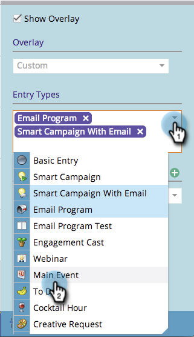

# Creazione di sovrapposizioni personalizzate nella vista Pianificazione programma {#creating-custom-overlays-in-program-schedule-view}

Potete creare sovrapposizioni personalizzate per visualizzare le voci pertinenti alle vostre esigenze.

1. Fare clic sul menu a discesa **Agenda**.

   

1. Selezionate **Overlays**.

   

1. Selezionate i tipi di voci che desiderate rendere visibili nella sovrapposizione.

   

1. È inoltre possibile filtrare i tag [programma](/help/marketo/product-docs/core-marketo-concepts/programs/working-with-programs/understanding-tags/use-tags-in-a-program.md).

   

   Fantastico. Ora la sovrapposizione visualizzerà solo le voci definite.

   
