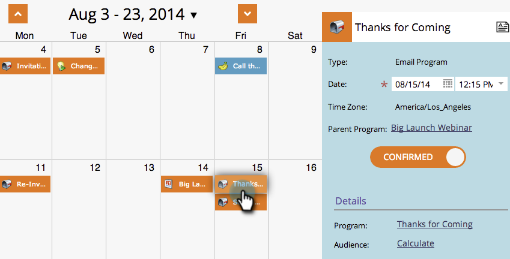

# Modifica delle voci nella vista Pianificazione programma {#editing-entries-in-the-program-schedule-view}

È possibile apportare modifiche ai diversi elementi del programma nella vista Pianificazione.

## Modificare il nome di una voce {#edit-an-entrys-name}

1. Selezionate la voce da modificare.

   

1. Digitare un nuovo nome e premere **Invio/A capo** sulla tastiera per confermare la modifica.

   

>[!CAUTION]
>
>Questo modifica solo il nome visualizzato nella vista Pianificazione. Il nome della risorsa nel programma rimarrà invariato.

## Modifica la descrizione di una voce {#edit-an-entrys-description}

1. Fate clic sull’icona della descrizione.

   

1. Modificate la descrizione. Fare clic su **Salva**.

   

1. Fantastico! La descrizione è stata modificata.

   

## Modifica della data di una voce {#edit-an-entrys-date}

1. Selezionare la nuova data.

   

Brutto! Ora la data di inserimento è stata spostata in una nuova data.

>[!NOTE]
>
> Non è possibile spostare in passato le voci di programmi e-mail e campagne intelligenti già eseguite.

