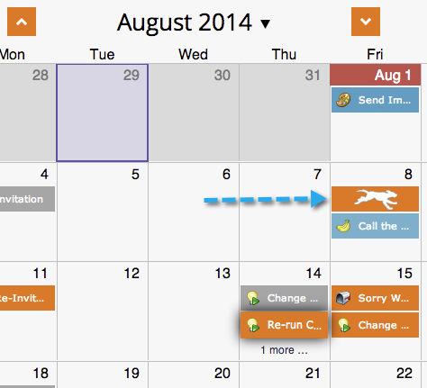

# Spostamento di voci nella vista Pianificazione programma {#moving-entries-in-the-program-schedule-view}

Lo spostamento delle voci nella vista Programmazione le riprogrammerà automaticamente.

>[!NOTE]
>
>Non è possibile spostare una campagna intelligente già eseguita, un programma di coinvolgimento o un&#39;esplosione di posta elettronica.

1. Seleziona la voce. Trascinalo e rilascialo in una data diversa.

   

1. Il nostro recupero dati quindi annulla l’approvazione, modifica la data e riapprova la risorsa. È figo così.

   

   La voce verrà ora ripianificata.

   
