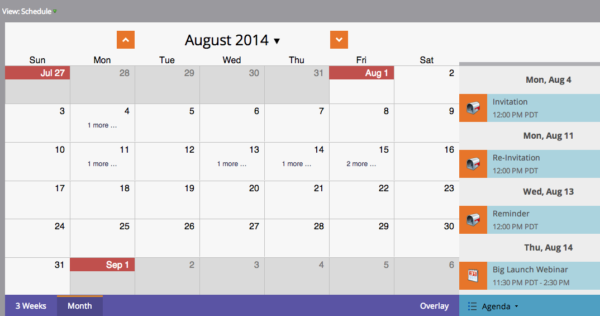
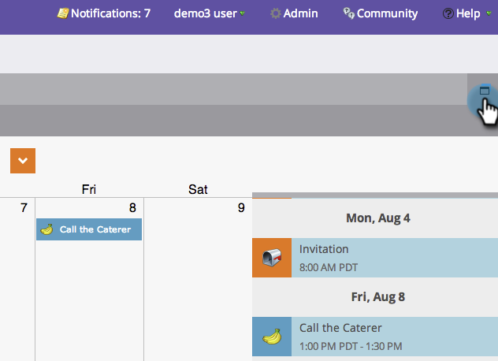

# Navigazione nella vista Programmazione programma {#navigating-the-program-schedule-view}

Di seguito sono riportate le nozioni di base per la navigazione nella visualizzazione della pianificazione del programma.

## Trovare la vista Schedule {#find-the-schedule-view}

1. Vai a **Attività di marketing**.

   

1. Seleziona il programma. Fai clic su **Visualizza** a discesa. Seleziona **Pianificazione**.

   

   Ora vedrai la visualizzazione della pianificazione del tuo programma.

   

>[!NOTE]
>
>La visualizzazione della pianificazione del programma è permanente. Una volta impostata, tutte le applicazioni avranno come impostazione predefinita la visualizzazione della programmazione.

## Passaggio tra le voci {#switching-between-entries}

1. Nei dettagli della voce, fare clic sulle frecce per passare alla voce pianificata successiva.

   

   Fantastico, eh?

   

## Menu di scelta rapida Visualizza {#view-context-menu}

1. Fai clic con il pulsante destro del mouse su un programma per apportare modifiche a Programma, Elenco avanzato, Configurazione, Token personali o Membri.

   

## Passaggio da una modalità all&#39;altra {#changing-between-modes}

1. Clic su **3 Weeks** o **Mese** modifica le date visibili sullo schermo.

   

## Visualizzazione a schermo intero {#full-screen-view}

1. Puoi fare clic sull’icona dello schermo nell’angolo in alto a destra per visualizzare la pianificazione del programma in modalità a schermo intero.

   

Fantastico! Ora che sai come visualizzare il tuo programma, impariamo le altre cose interessanti che può fare.

>[!MORELIKETHIS]
>
>[Creazione di una voce nella vista Programmazione programma](/help/marketo/product-docs/core-marketo-concepts/programs/program-schedule-view/creating-an-entry-in-the-program-schedule-view.md)
