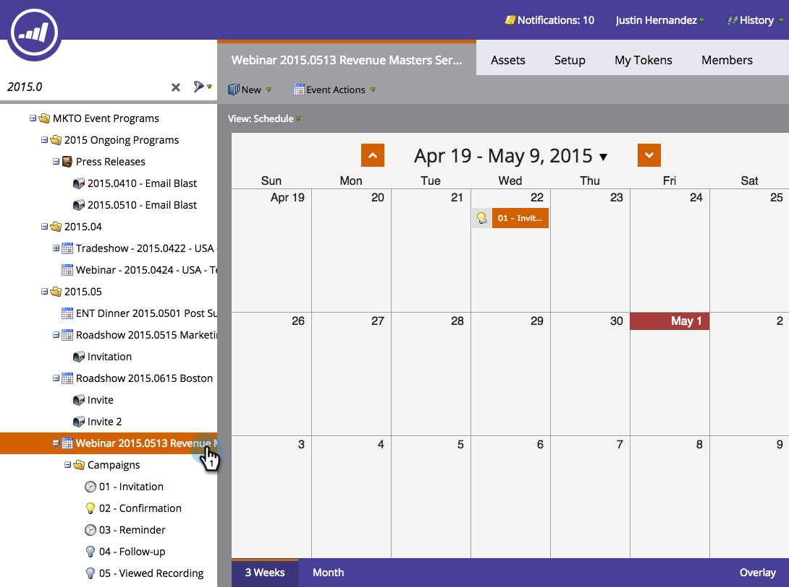

# Eseguire nuovamente una campagna avanzata nella vista Pianificazione del programma {#rerun-a-smart-campaign-in-the-program-schedule-view}

Puoi creare facilmente nuove esecuzioni di una campagna avanzata esistente direttamente dalla vista pianificazione del programma.

1. Passa a **[!UICONTROL Marketing Activities]**.

   

1. Seleziona un programma che contiene Smart Campaign.

   

1. Nella visualizzazione della pianificazione, fare clic sul giorno per il quale si desidera impostare la nuova esecuzione e assegnare alla voce un nome facilmente comprensibile (ad esempio, &quot;Secondo invito&quot;).

   

1. Seleziona l’elenco a discesa del menu del tipo di voce e scegli la Smart Campaign da rieseguire.

   

   >[!TIP]
   >
   >Puoi eseguire questa operazione anche dal [programma attivo](/help/marketo/product-docs/core-marketo-concepts/marketing-calendar/understanding-the-calendar/understand-enable-program-focus.md).

Boom! Proprio così, hai pianificato un’altra esecuzione per quella Smart Campaign. Se la Smart Campaign conteneva passaggi per l’invio di e-mail, li vedrai anche tu!
