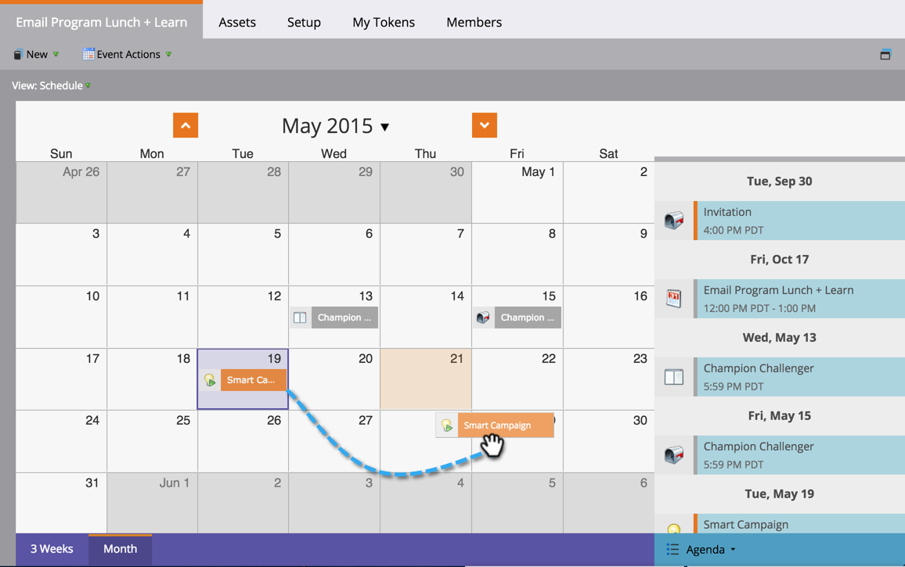

# Riprogrammare una campagna batch intelligente nella visualizzazione Pianificazione del programma {#reschedule-a-batch-smart-campaign-in-the-program-schedule-view}

Ripianificare l’esecuzione di una campagna batch? Trascinali e rilasciali nel futuro nella visualizzazione Pianificazione del programma.

1. Seleziona la campagna avanzata da ripianificare.

   

1. Trascina fino alla nuova data in cui desideri eseguire la campagna.

1. Fantastico! La campagna avanzata è stata ripianificata. L&#39;ora può anche essere modificata dalla **[!UICONTROL Data]** nei dettagli della voce.

   

>[!MORELIKETHIS]
>
>[Riprogrammazione di un intero programma dalla vista Pianificazione](/help/marketo/product-docs/core-marketo-concepts/programs/program-schedule-view/rescheduling-an-entire-program-from-the-schedule-view.md){target="_blank"}
