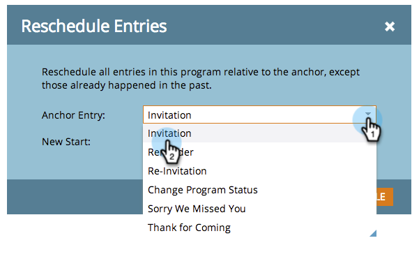

# Riprogrammazione di un intero programma dalla vista Pianificazione {#rescheduling-an-entire-program-from-the-schedule-view}

Quando cloni un programma o un evento con date, è probabile che desideri ripianificare tutte le date contemporaneamente. Ecco come.

1. Selezionare il programma da riprogrammare.

   

1. Seleziona il menu a discesa Azione evento . Scegliere **Riprogramma voci**.

   

1. Seleziona una voce di ancoraggio. In base a questo spostamento, tutte le altre voci si sposteranno insieme ad esso.

   

1. Scegli la nuova data di inizio.

   

1. Fare clic su **Riprogramma**.

   

1. I recuperatori di dati annulleranno quindi l’approvazione, la riprogrammazione e la riapprovazione di tutte le risorse con le date corrette.

   

>[!NOTE]
>
>Le risorse già eseguite non verranno spostate.

Tutto è ora riprogrammato. Modifica le date specifiche in base alle esigenze.

