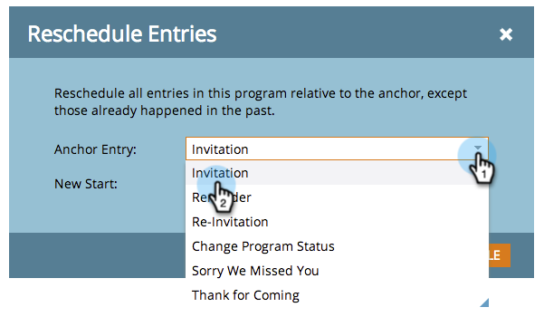
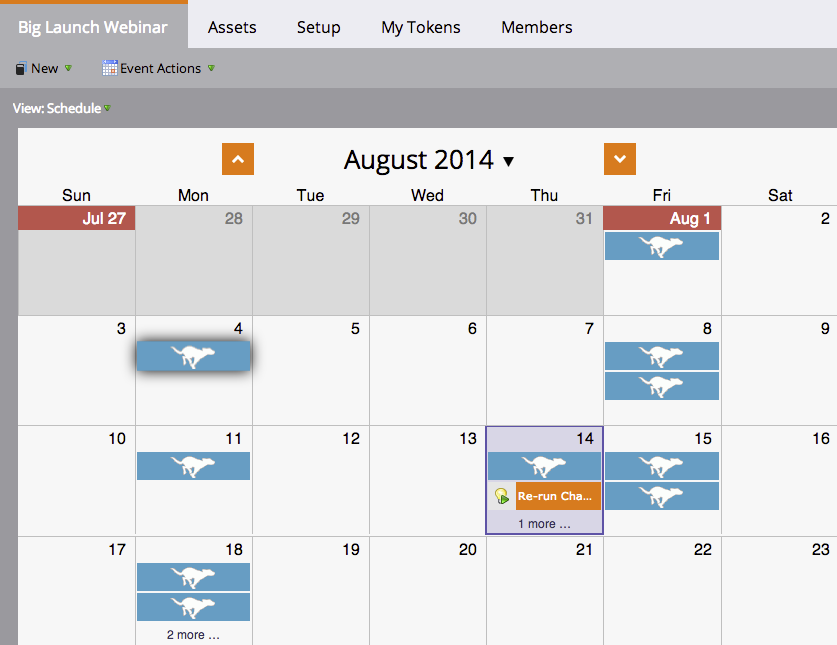
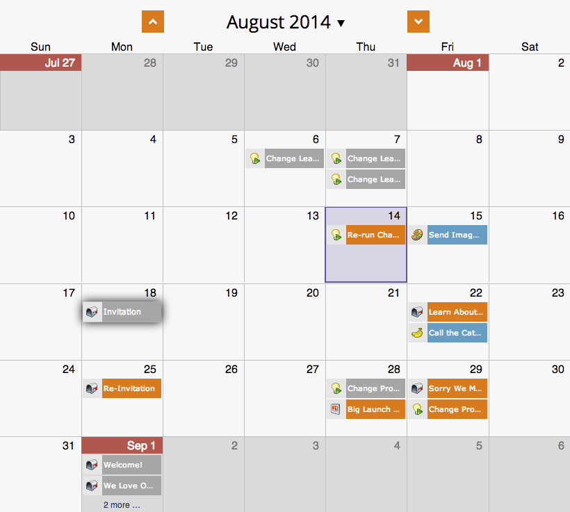

# Ripianificazione di un programma intero dalla vista Pianificazione {#rescheduling-an-entire-program-from-the-schedule-view}

Quando si clona un programma o un evento con date, è probabile che si desideri riprogrammare tutte le date contemporaneamente. Ecco come.

1. Selezionare il programma da riprogrammare.

   

1. Seleziona il menu a discesa Azione evento. Scegli **[!UICONTROL Reschedule Entries]**.

   

1. Selezionare un [!UICONTROL Anchor Entry]. In base a questo spostamento, tutte le altre voci si sposteranno insieme a esso.

   

1. Scegli la data [!UICONTROL New Start].

   

1. Fai clic su **[!UICONTROL Reschedule]**.

   

1. I nostri responsabili del recupero dati annulleranno, ripianificheranno e riapproveranno tutte le risorse con le date corrette.

   

>[!NOTE]
>
>Assets già in esecuzione non si sposterà.

Ora tutto è stato riprogrammato. Regola eventuali date specifiche in base alle esigenze.

