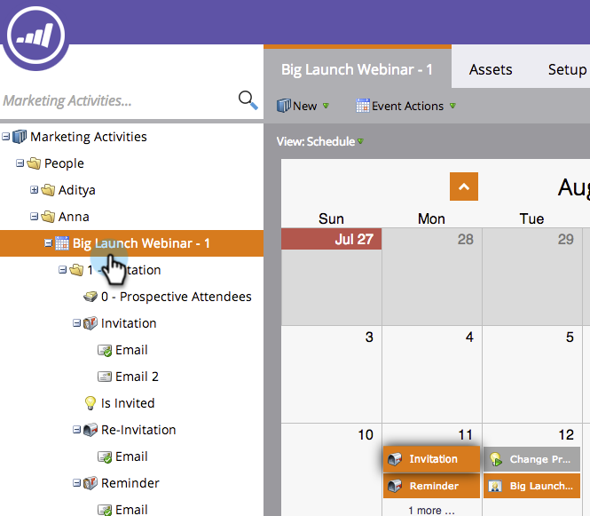

# Riprogrammazione di un intero programma dalla vista Pianificazione {#rescheduling-an-entire-program-from-the-schedule-view}

Quando si duplica un programma o un evento con date, è probabile che si desideri riprogrammare tutte le date contemporaneamente. Ecco come.

1. Selezionare il programma da riprogrammare.

   

1. Selezionate il menu a discesa Azione evento. Scegliere **Riprogrammare le voci**.

   

1. Selezionate una voce di ancoraggio. In base a questo spostamento, tutte le altre voci si sposteranno insieme.

   

1. Scegliere la nuova data di inizio.

   

1. Fare clic su **Riprogrammare**.

   

1. I nostri recuperatori di dati disapproveranno, ripianificheranno e riapproveranno tutte le tue risorse con le date corrette!

   

>[!NOTE]
>
>Le risorse già eseguite non verranno spostate.

Ora tutto è stato rimandato. Regolate le date specifiche in base alle esigenze.

