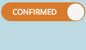

# Informazioni sulle date provvisorie/confermate {#understanding-tentative-confirmed-dates}

Le campagne e i programmi e-mail intelligenti hanno una potente funzionalità da contrassegnare come **Tentative** o **Confermato**. Ecco come funzionano.

## Provvisorio {#tentative}

Le date provvisorie trasmettono l&#39;intento. Considera questo come _apposizione della matita_ qualcosa nel calendario. Le voci provvisorie non verranno eseguite, ma solo segnaposto.

>[!NOTE]
>
>Solo le campagne avanzate in batch e i programmi e-mail possono essere provvisori.

## Conferma delle voci {#confirming-entries}

È simile all’approvazione di una risorsa, pertanto le voci devono essere configurate completamente prima di poterle confermare. Una volta che tutte le anatre sono in fila, è possibile confermare le voci facendo scorrere la scheda provvisoria a destra.

>[!NOTE]
>
>Perché il cane? Lui è un Recupera. Sta raccogliendo i tuoi dati.

## Confermato {#confirmed}

Le voci confermate verranno sicuramente eseguite. Hanno regole, risorse approvate e una data e un&#39;ora confermate.

## Completato {#finished}

Le voci completate sono già in esecuzione. Possono essere solo nel passato (ovviamente). Una volta eseguita una voce ed è **Finished**, non è possibile spostarla o renderla provvisoria. (Nessun cambiamento della realtà e interruzione del continuum del flusso temporale).

Questi stati sono strumenti potenti. Quando cloni un programma, tutte le date della campagna intelligente e del programma e-mail saranno indicative. È possibile confermarli direttamente dalla vista della pianificazione. Freddo, vero?
