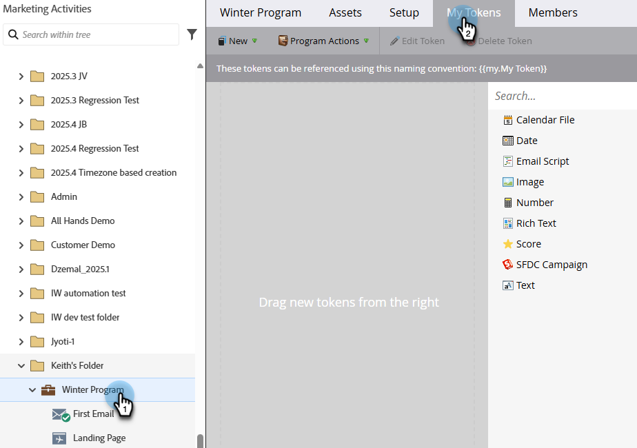
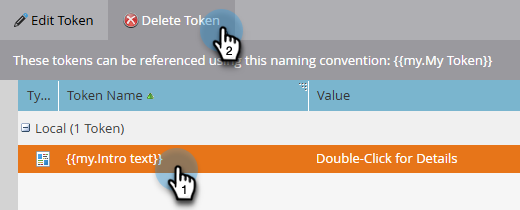
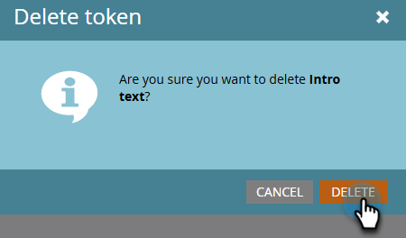

# Gestire I miei token {#managing-my-tokens}

L’utilizzo dei token può semplificare le attività in Marketo Engage. Puoi utilizzare [I miei token](/help/marketo/product-docs/core-marketo-concepts/programs/tokens/understanding-my-tokens-in-a-program.md){target="_blank"} (token personalizzati) nei passaggi del flusso, nei webhook, nelle e-mail e nelle pagine di destinazione. Ecco come farle.

>[!TIP]
>
>Ulteriori informazioni sui token già disponibili in [Panoramica dei token](/help/marketo/product-docs/demand-generation/landing-pages/personalizing-landing-pages/tokens-overview.md){target="_blank"}.

## Creare un token personale locale o globale {#create-a-my-token}

>[!BEGINTABS]

>[!TAB Token personali locali]

1. In **[!UICONTROL Marketing Activities]**, selezionare il programma o la cartella della campagna desiderata e fare clic sulla relativa scheda **[!UICONTROL My Tokens]**.

   

1. Trascina il token desiderato nell’area di lavoro.

   

1. Digita un nome univoco e immetti un valore pertinente.

   

1. Fai clic su **[!UICONTROL Save]**.

   

>[!TAB Token personali globali]

>[!NOTE]
>
>Autorizzazioni di amministrazione richieste.

1. Passare all&#39;area **[!UICONTROL Admin]** e selezionare **[!UICONTROL My Tokens]**.

   

1. Trascina il token desiderato nell’area di lavoro.

   

1. Digita un nome univoco e immetti un valore pertinente.

   

1. Fai clic su **[!UICONTROL Save]**.

   

>[!ENDTABS]

## Modifica un token personale {#edit-a-my-token}

1. Selezionare il token da modificare e fare clic su **[!UICONTROL Edit Token]**.

   

1. Apporta le modifiche desiderate. Al termine, fai clic su **[!UICONTROL Save]**.

   

## Eliminare un token personale {#delete-a-my-token}

>[!CAUTION]
>
>Quando elimini un token personale, accertati che non vi sia attualmente riferimento in alcuna risorsa. Se viene eliminato, uno spazio vuoto verrà visualizzato in qualsiasi punto in cui viene fatto riferimento a tale spazio.

1. Selezionare il token da eliminare e fare clic su **[!UICONTROL Delete Token]**.

   

1. Fai clic su **[!UICONTROL Delete]**.

   

   >[!MORELIKETHIS]
   >
   >* [Panoramica dei token](/help/marketo/product-docs/demand-generation/landing-pages/personalizing-landing-pages/tokens-overview.md){target="_blank"}
   >* [Informazioni sui token in un programma](/help/marketo/product-docs/core-marketo-concepts/programs/tokens/understanding-my-tokens-in-a-program.md){target="_blank"}
   >* [Utilizzo di URL nei miei token](/help/marketo/product-docs/email-marketing/general/using-tokens/using-urls-in-my-tokens.md){target="_blank"}
