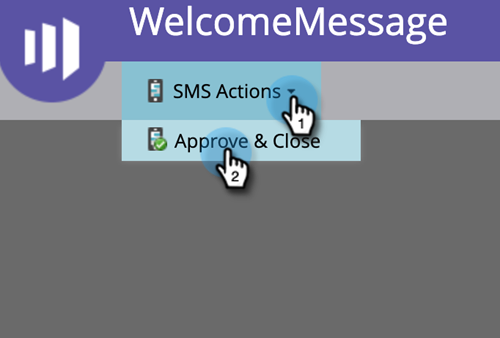
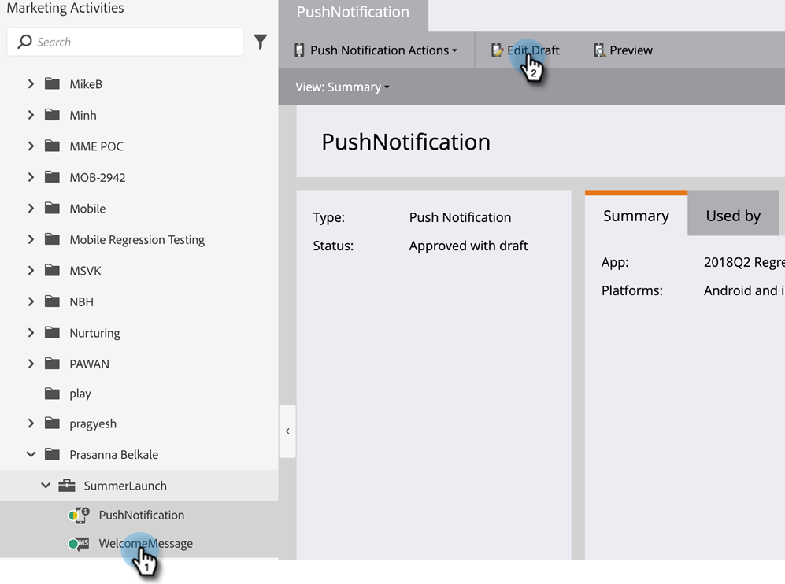

# Token dei campi personalizzati dei membri del programma {#program-member-custom-field-tokens}

## Supporto token per i campi personalizzati dei membri del programma {#token-support-for-program-member-custom-fields}

Sul retro delle funzionalità Campi personalizzati dei membri del programma, è in corso l’estensione del supporto per i campi personalizzati dei membri del programma nei framework dei token.

I token PMCF saranno supportati nel dominio membro della famiglia di token.

I token membri sono utilizzati per i campi che rientrano nell’ambito di partecipazione al programma. Allo stato attuale, i token degli Stati membri sono utilizzati anche per inserire valori univoci da partner di servizi integrati. `{{member.webinar url}}` il token risolve automaticamente l’URL di conferma univoco della persona generato dal provider di servizi. {{membro.registration code}} risolve il codice di registrazione fornito dal provider di servizi.

>[!NOTE]
>
>* I campi personalizzati dei membri del programma possono essere utilizzati solo nel contesto di un programma.
>* I token dei campi personalizzati dei membri del programma non possono essere utilizzati in: preintestazione e-mail, token di data in passaggi di attesa o snippet.
>* Lo stato dei membri del programma non è supportato nei token membri.

## Utilizzo dei token di campo personalizzati dei membri del programma nelle risorse {#using-program-member-custom-field-tokens-in-assets}

Puoi inserire token di campi personalizzati dei membri del programma in e-mail, pagine di destinazione, SMS, notifiche push e webhook.

**E-mail**

1. Seleziona l’e-mail desiderata e fai clic su **Modifica bozza**.

   

1. Fai clic sull’icona Inserisci token .

   

1. Trova e seleziona il Token di campo personalizzato del membro del programma desiderato, inserisci un valore predefinito e fai clic su **Inserisci**.

   

1. Fare clic su **Salva**.

   

>[!NOTE]
>
>Non dimenticarti di approvare la tua e-mail.

**Pagine di destinazione**

1. Seleziona la pagina di destinazione e fai clic su **Modifica bozza**.

   

   >[!NOTE]
   >
   >La finestra di progettazione della pagina di destinazione viene aperta in una nuova finestra.

1. Fare doppio clic sulla casella RTF a cui si desidera aggiungere il token.

   

1. Fai clic nel punto in cui desideri che sia il token, quindi fai clic sull’icona Inserisci token .

   

1. Trova e seleziona il token desiderato.

   

1. Immetti un valore predefinito e fai clic su **Inserisci**.

   

1. Fare clic su **Salva**.

   

**SMS**

1. Seleziona l’SMS desiderato e fai clic su **Modifica bozza**.

   

1. Fai clic sul pulsante **`{{ Token`** .

   

1. Trova e seleziona il token campo personalizzato del membro del programma desiderato. Immettere un valore predefinito e fare clic su Inserisci.

   

1. Fai clic sull’elenco a discesa Azioni SMS e seleziona **Approva e chiudi**.

   

**Notifiche push**

1. Seleziona la notifica push desiderata e fai clic su **Modifica bozza**.

   

1. Fai clic su **Notifica push**.

   

1. Fai clic sul messaggio nell’editor e fai clic sul pulsante `{{` per ottenere il selettore dei token.

   

1. Trova e seleziona il token campo personalizzato del membro del programma desiderato. Immetti un valore predefinito e fai clic su **Inserisci**.

   

1. Fare clic su **Fine** per salvare e uscire (oppure su **Avanti** per eseguire prima la revisione).

   

>[!NOTE]
>
>Se il campo personalizzato del membro del programma per un membro del programma non ha valore, il token verrà sostituito con il valore predefinito, se specificato.

## Utilizzo dei token di campo personalizzati dei membri del programma nelle campagne {#using-program-member-custom-field-tokens-in-campaigns}

I token di campo personalizzati dei membri del programma possono essere utilizzati in:

* Crea attività
* Crea attività in Microsoft
* Momenti interessanti
* Modificare le azioni del flusso di dati
* Webhook
