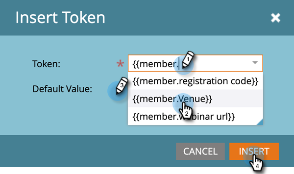
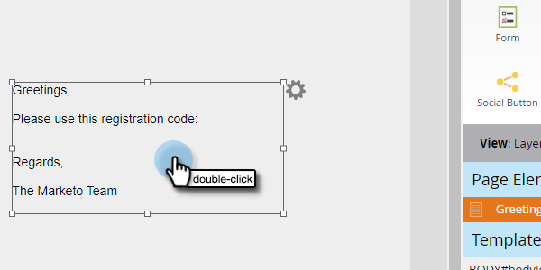

# Token campo personalizzato membro programma {#program-member-custom-field-tokens}

## Supporto token per i campi personalizzati dei membri del programma {#token-support-for-program-member-custom-fields}

Sul pannello posteriore delle funzioni Campi personalizzati membro del programma, è in corso l&#39;estensione del supporto per i campi personalizzati membro del programma nei framework dei token.

I token PMCF saranno supportati nel dominio membro della famiglia di token.

I token dei membri vengono utilizzati per i campi che rientrano nell’ambito di Membro del programma. Allo stato attuale, i token membro vengono utilizzati anche per inserire valori univoci dai partner di servizi integrati. `{{member.webinar url}}` Il token risolve automaticamente l’URL univoco di conferma della persona generato dal provider di servizi. {{member.registration code}} viene risolto nel codice di registrazione fornito dal provider di servizi.

>[!NOTE]
>
>* I campi personalizzati dei membri del programma possono essere utilizzati solo nel contesto di un programma.
>* I token dei campi personalizzati dei membri del programma non possono essere utilizzati in: preheader e-mail, Token di data in Wait Steps o Snippet.
>* Lo stato dei membri del programma non è supportato nei token dei membri.

## Utilizzo dei token dei campi personalizzati dei membri del programma nelle risorse {#using-program-member-custom-field-tokens-in-assets}

Puoi inserire token dei campi personalizzati dei membri del programma in e-mail, pagine di destinazione, SMS, notifiche push e webhook.

**E-mail**

1. Seleziona l’e-mail desiderata e fai clic su **Modifica bozza**.

   

1. Fai clic sull’icona Inserisci token.

   

1. Trova e seleziona il token del campo personalizzato del membro del programma desiderato, immetti un valore predefinito e fai clic su **Inserisci**.

   

1. Clic **Salva**.

   

>[!NOTE]
>
>Non dimenticare di approvare l’e-mail.

**Pagine di destinazione**

1. Seleziona la pagina di destinazione e fai clic su **Modifica bozza**.

   

   >[!NOTE]
   >
   >Il designer della pagina di destinazione si apre in una nuova finestra.

1. Fare doppio clic sulla casella di testo RTF a cui si desidera aggiungere il token.

   

1. Fai clic nel punto in cui desideri inserire il token, quindi fai clic sull’icona Inserisci token.

   

1. Trova e seleziona il token desiderato.

   

1. Inserisci un valore predefinito e fai clic su **Inserisci**.

   

1. Clic **Salva**.

   

**SMS**

1. Seleziona l’SMS desiderato e fai clic su **Modifica bozza**.

   

1. Fai clic su **`{{ Token`** pulsante.

   

1. Individua e seleziona il token del campo personalizzato del membro del programma desiderato. Immettere un valore predefinito e fare clic su Inserisci.

   

1. Fai clic sul menu a discesa Azioni SMS e seleziona **Approva e chiudi**.

   

**Notifiche push**

1. Seleziona la notifica push desiderata e fai clic su **Modifica bozza**.

   

1. Clic **Notifica push**.

   

1. Fai clic sul messaggio nell’editor e fai clic sul pulsante `{{` per ottenere il selettore del token.

   

1. Individua e seleziona il token del campo personalizzato del membro del programma desiderato. Immetti un valore predefinito e fai clic su **Inserisci**.

   

1. Clic **Fine** per salvare ed uscire (oppure **Successivo** per prima cosa).

   

>[!NOTE]
>
>Se il campo personalizzato Membro del programma per un membro del programma non contiene alcun valore, il token verrà sostituito con il valore predefinito, se fornito.

## Utilizzo dei token di campo personalizzati dei membri del programma nelle campagne {#using-program-member-custom-field-tokens-in-campaigns}

I token di campo personalizzati dei membri del programma possono essere utilizzati in:

* Crea attività
* Crea attività in Microsoft
* Momenti di interesse
* Azioni di flusso per cambiare il valore dei dati
* Webhook
