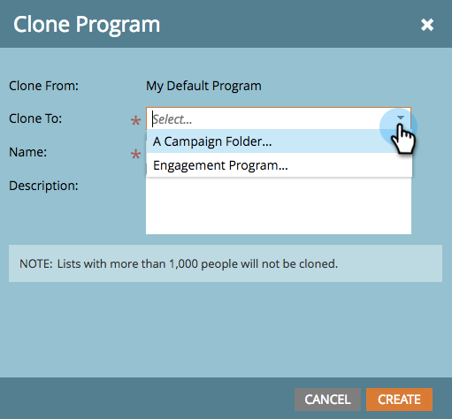

# Clona un programma {#clone-a-program}

Duplica in modo rapido e semplice un intero programma e tutte le relative risorse invece di ricostruire tutto manualmente.

>[!PREREQUISITES]
>
>Prima di immergerti, scopri [best practice per evitare la corruzione nelle risorse clonate](https://nation.marketo.com/t5/Knowledgebase/Avoiding-Corruption-in-Cloned-Assets/ta-p/249729).

1. Trova e seleziona il programma da clonare, quindi in **Azioni del programma** click **Clona**.

   

1. Selezionare la posizione in cui si desidera duplicare il programma.

   >[!NOTE]
   >
   >I programmi possono essere clonati in [campagna](/help/marketo/product-docs/core-marketo-concepts/miscellaneous/create-new-campaign-folder.md) [cartelle](/help/marketo/product-docs/core-marketo-concepts/miscellaneous/create-new-campaign-folder.md) o [aree di lavoro](/help/marketo/product-docs/administration/workspaces-and-person-partitions/create-a-new-workspace.md). Assicurati di condividere tutte le risorse dipendenti sottostanti (e-mail, snippet, modelli di pagina di destinazione, ecc.) con l’area di lavoro di destinazione prima della duplicazione.

   

   >[!NOTE]
   >
   >Vedi quella NOTA nella schermata precedente? Significa che se clonate un programma con 1000 o più persone in un elenco, l&#39;elenco stesso verrà clonato, ma sarà vuoto. Se clonate un programma con un elenco che contiene 999 persone o meno, tale elenco, insieme a tutti i suoi membri, apparirà nel programma clonato.

1. Immettere un Nome.

   

1. Scegliere la cartella in cui si desidera duplicare il programma.

   

1. Aggiungi una descrizione facoltativa, quindi fai clic su **Crea**. Guarda quanto velocemente sei stato in grado di creare un nuovo programma con tutte le sue risorse pronte ad andare!

   

   >[!TIP]
   >
   >Utilizza questa tecnica insieme ai token per creare un nuovo programma.

   >[!CAUTION]
   >
   >I costi del periodo non verranno trasferiti, quindi assicurati di aggiungerlo al programma clonato se ne è stato impostato uno nell&#39;originale.
